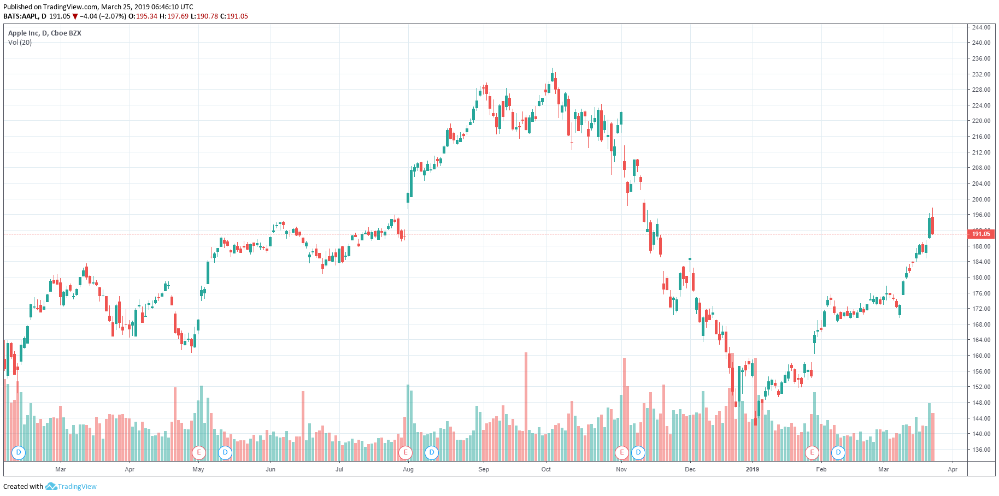
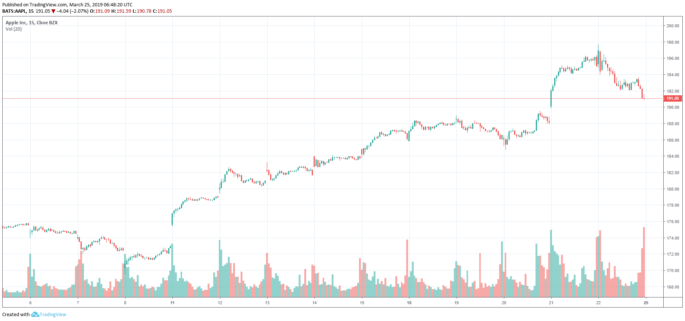
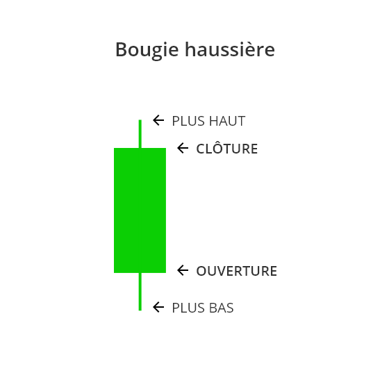
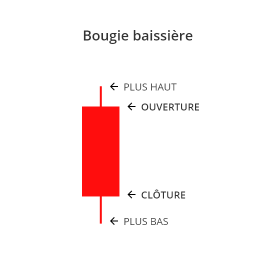
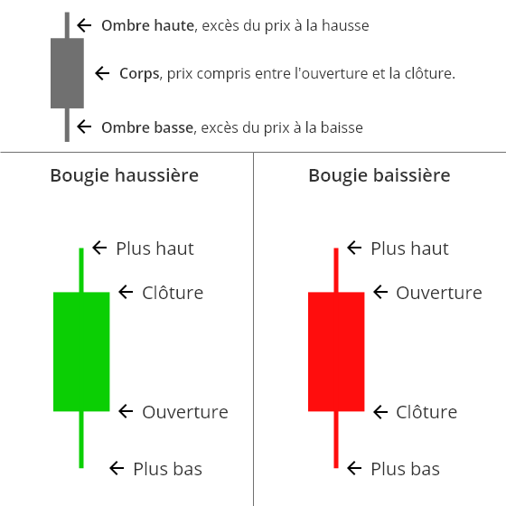

## Qu'est-ce qu'une bougie japonaise ?

 Les **bougies japonaises** (ou chandeliers japonais) sont apparues au Japon (avouez que vous ne vous en doutiez pas) entre le 17ème et le 18ème siècle. Si leurs origines exactes restent inconnues, on doit leur théorisation à un trader japonais, [Muneshisa Homma](https://fr.wikipedia.org/wiki/Munehisa_Honma), qui les utilisaient pour spéculer sur le cours du riz.

Leur objectif est simple: présenter de manière graphique les différentes actions du prix sur une période de temps donné.

### Ouverture et clôture et unités de temps

Pour appréhender le fonctionnement d'une bougie japonaise, il est essentiel de comprendre quelques notions préalables et notamment celles des **unités de temps** (ou Timeframe) et du combo **ouverture/clôture**.

#### Les unités de temps

Une UT (pour Unité de Temps) est une période de temps servant de découpage à un graphique. Concrètement, si vous regarder le cours du Bitcoin sur l'UT journalière, chacune des bougies contiendra les informations relatives aux prix pendant 24h. Si vous basculez sur l'UT 15 min, chaque bougie représentera un segment de... 15min (logique).

*Le cours d'Apple en journalier. Chaque bougie représente une journée de cotation*.

*Le cours d'Apple sur une UT 15m. Chaque bougie représente 15min de cotation.*

#### Ouverture et clôture

Second concept indispensable pour comprendre les bougies japonaises: le combo ouverture/clôture. Ici, rien de bien compliqué, **l'ouverture** représente simplement le prix à la formation d'une nouvelle bougie. 

Un exemple pour bien comprendre: il est 15h55 et vous regardez le cours d'un actif sur un graphique 1h (chaque bougie représente donc... 1h). A 16h00 pile, une nouvelle bougie va donc apparaître sur votre écran, sur un certain niveau de prix: c'est l'ouverture.

Quand à la **clôture**, vous l'aurez compris, elle représente le dernier prix contenu dans une bougie. Dans notre exemple précédent, le prix à 15h59m59s représentera le prix de clôture de la bougie 15h-16h.

## Comment lire une bougie japonaise ?

Maintenant que les bases indispensables sont posées, revenons à nos fameuses bougies.

Chaque bougie se compose de deux parties: 

* Le **corps** (la partie centrale) qui représente la variation du prix entre l'ouverture et la clôture. **Plus le corps est important, plus la variation est grande.**
* Les **ombres** (les deux segments entourant le corps) qui représentent les deux extrêmes du cours. Le point le plus haut de l'ombre haute (le segment supérieur) représente le plus haut prix atteint pendant la durée de la bougie. Le point le plus bas de l'ombre basse (le segment inférieur), représente quand à lui le prix le plus bas atteint pendant cette durée. 

L'anglais étant omniprésent dans le monde du trading, vous entendrez souvent les mots suivants pour décrire les concepts évoqués ci-dessus:

* OPEN (ouverture)
* CLOSE (fermeture)
* HIGH (plus haut)
* LOW (plus bas)

### Bougie haussière et bougie baissière

Il existe une subtilité dans la lecture des bougies en fonction de la direction des prix. 

Dans le cas d'une **bougie haussière (souvent représentée en vert sur les graphiques), l'ouverture se trouve en bas du corps et la clôture en haut**. Logique puisque l'évolution du prix est positive (le prix de clôture est plus élevé  que celui d'ouverture, bref ça monte). 

*Schéma d'une bougie haussière. L'ouverture se trouve en bas du corps et la clôture en haut.*

Dans le cas d'une **bougie baissière (représentée en rouge par défaut), l'ouverture et la clôture inversent leur place respective**. Là encore, rien de plus logique. Le prix ayant imprimé une baisse durant la durée de vie de la bougie, l'ouverture se trouve **au-dessus** de la clôture. Donc bougie baissière = ouverture en haut, clôture en bas.

Les positions des ombres, quand à elles ne varient pas (l'ombre haute représentera toujours le plus haut et l'ombre basse le plus bas, quel que soit le sens de la bougie).

*Schéma d'une bougie baissière. L'ouverture se trouve en haut du corps et la clôture en bas.*

## Résumé et conclusion

* Bougie japonaise = représentation graphique de l'évolution du prix pendant une portion de temps donnée, dépendant de l'unité de temps sur lequel est réglé le graphique.
* Bougie japonaise composée de deux parties:
  * le corps (partie pleine au centre de la bougie): différence de prix entre ouverture et clôture
  * les ombres (segments dépassants du corps): extrêmes du marché.
* Bougie haussière (verte): Ouverture en bas, clôture en haut
* Bougie baissière (rouge): Ouverture en haut, clôture en bas.

### Les bougies japonaises, schéma récapitulatif

### Conclusion

Bravo, vous savez maintenant lire ces fameuses bougies. L'étape suivante est de comprendre leur utilité. A quoi servent-elles exactement et pourquoi les utiliser ?   C'est ce que nous verrons dans la partie 2 de cet article.

