## Les bougies japonaises, reflets de la psychologie du marché

Le marché se résume à une opposition entre deux forces contraires. D'un côté les acheteurs, poussant pour une hausse des prix. De l'autre les vendeurs, cherchant à l'inverse à faire plonger les cours. Lorsque les deux camps se neutralisent, le prix reste stable, mais si l'une des parties prend le dessus, alors une direction est donnée, un mouvement s'amorce et le sentiment de marché prend un biais tendanciel. 

C'est sur ce concept de **sentiment de marché** qu'interviennent nos fameuses bougies. En nous fournissant le détail des mouvements de prix, elles nous renseignent sur le sentiment dominant et sur la psychologie des acteurs.

Pour illustrer cela, prenons quelques exemples de bougies parmi les plus classiques et tentons de définir la **psychologie de marché** qui en découle: 

### Les bougies isolées

#### Les marobuzu

##### Marobuzu haussier

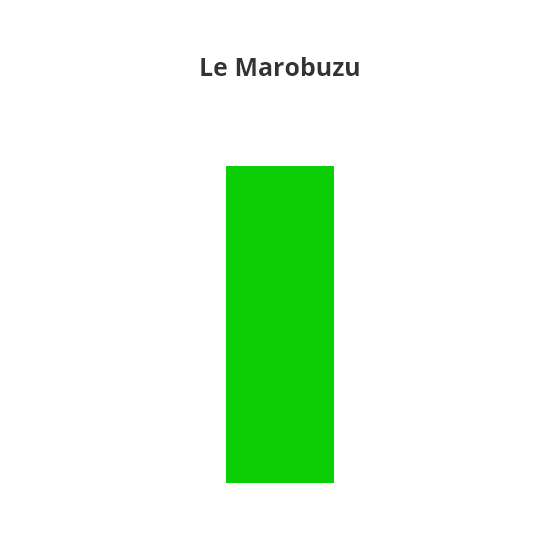

Imaginons que vous voyez en face d'une grosse bougie verte comme celle ci-dessus. Que peut-on en déduire ? C'est vert, donc haussier. 

L'ouverture se trouve donc en bas du corps et la clôture en haut. Aucune ombre n'apparaît, c'est qu'il n'y a pas eu d'excès (le plus bas correspond à l'ouverture, le plus haut à la clôture). 

Ici, il est clair que **les acheteurs ont pris la main** durant toute la durée de la bougie sans laisser la moindre chance aux vendeurs. Le sentiment de marché est donc **purement haussier**.

##### Marobuzu baissier

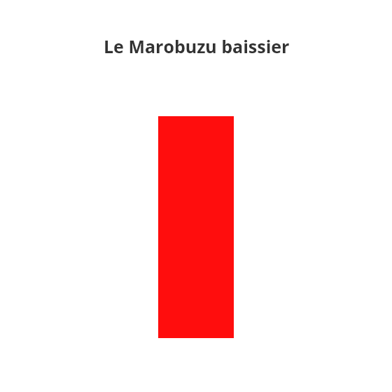

A l'inverse, ici ce sont les vendeurs qui se sont rendus maîtres du marché, ne laissant aucune place aux acheteurs. Le sentiment est donc **purement baissier**.

#### Dojis et Spinning Top

##### Dojis

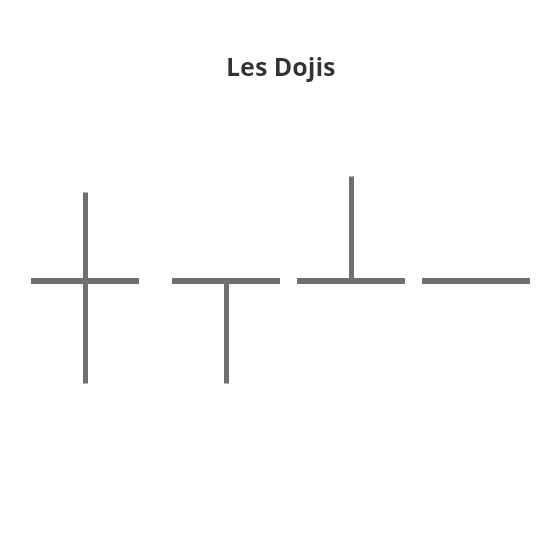

Nouvel exemple. Ici, l'on peut voir un corps extrêmement fin, accompagné ou non de mèches vers le haut ou le bas. La finesse du corps nous indique que le cours n'a quasi pas varié entre l'ouverture et la clôture. 

Des tentatives de prise de contrôle ont peut-être eu lieu dans l'un ou l'autre des camps (ou les deux, comme sur la première bougie, composée d'une mèche basse et d'une mèche haute), mais se sont soldées par des échecs. 

Les deux camps se neutralisent complètement, **le marché hésite et le sentiment est neutre**. 

##### Spinning top

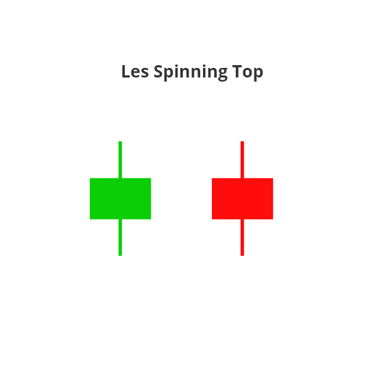

Dans le même esprit de neutralité, on trouve les **Spinning top**. Un corps assez fin, accompagné de deux mèches d'approximativement même longueur. Pendant la durée de cette bougie, les deux camps ont bataillé, mais aucun n'a vraiment pris un avantage significatif.

**Le marché est dans l'indécision** et il faudra attendre la bougie suivante pour espérer voir se dégager un mouvement.

#### Marteau et pendu (Hammer et Hanging Man)

Un petit corps, pas d'ombre haute (ou presque) et une longue ombre basse. Voici les caractéristiques de ces deux bougies: le **marteau** et le **pendu**. Deux bougies qui indiquent un **changement de sentiment dominant** sur le marché.

 ***Ici, les couleurs des bougies n'ont qu'une importance limitée, ce qui compte c'est leur timing d'apparition.***

##### Le marteau (Hammer)

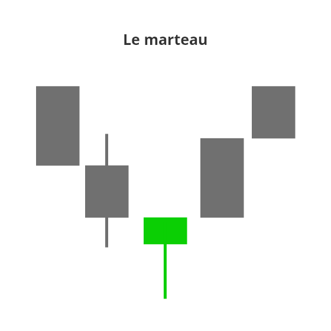

Apparaissant dans une tendance baissière, le **marteau indique un possible retournement haussier**. Un peu de psychologie pour comprendre:

Nous sommes en tendance baissière, les vendeurs tirent donc les prix vers le bas. Pendant la formation du **marteau**, les prix ont continué à chuter mais, arrivés à un certain niveau, les acheteurs ont repris le dessus et sont parvenus à stopper l'hémorragie et à faire remonter le cours avant la clôture de la bougie (d'où la longue mèche basse). 

Le contrôle a donc changé de main et les vendeurs semblent être arrivés au bout de leurs limites pour le moment. Le retournement haussier est donc possible.

##### Le pendu (Hanging Man)

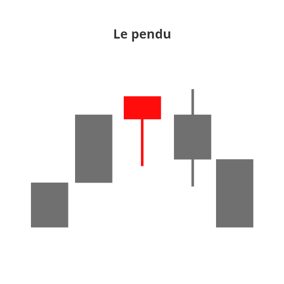

Le **pendu** a exactement les mêmes caractéristiques que le marteau. Corps court, pas ou peu d'ombre haute et une longue ombre basse. La seule différence, c'est qu'il intervient dans une **tendance haussière**. Comme le marteau, il est un indicateur d'un possible retournement.

Nous sommes en tendance haussière, les acheteurs ont la main. Mais pendant la formation du pendu, les vendeurs sont parvenus à tirer le cours vers le bas de manière significative. 

Certes les acheteurs ont réussi à sauver les meubles avant la clôture (d'où la longue mèche basse) mais, pour cela, ils ont du batailler et ne sont pas parvenus à poursuivre véritablement l'ascension. Peut-être sont-ils à bout de force, et le marché est-il prêt pour un **retournement baissier**.

#### Marteau inversé et étoile filante (Inverted Hammer / Shooting Star)

Miroirs du marteau et du pendu, le **marteau inversé** et l'**étoile filante** indiquent elles aussi un possible retournement de tendance. Elles se composent des caractéristiques suivantes: un petit corps, une absence d'ombre basse et une longue ombre haute. 

Attention cependant à ne pas entrer en position trop vite sur ce type de figure, il est largement préférable d'attendre une seconde bougie de confirmation. Les marteaux inversés et les étoiles filantes sont le signe d'une hésitation dans la psychologie dominante mais en aucun cas une assurance de son retournement.

##### Marteau inversé (Inverted Hammer)

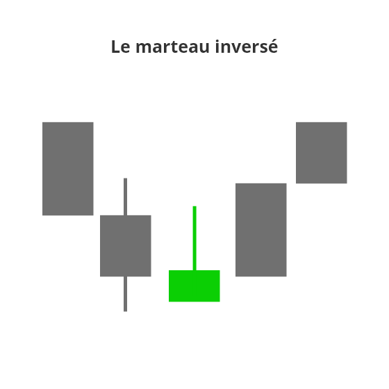

**Figure de retournement haussier**, le marteau inversé prend toute son importance dans une tendance baissière. Les vendeurs poussent le prix vers le bas, mais, pendant la formation du marteau, les acheteurs semblent se réveiller et tente de reprendre le contrôle du marché, avant d'être violemment repousser par leurs adversaires.

Malgré tout, pour les vendeurs, c'est un signe qu'ils ne sont plus seuls et que les forces adverses sont de retour. Certains choisissent alors de racheter leurs positions en attendant la suite. Le marché entre dans une phase d'indécision et la bougie suivante déterminera la psychologie dominante. 

En cas de bougie haussière, les vendeurs un peu trop agressifs restés en position verront leurs positions clôturés, et les acheteurs enhardis par ce changement, reprendront le contrôle. La psychologie dominante change de camp et le retournement haussier est complété.

##### L'étoile filante (Shooting Star)

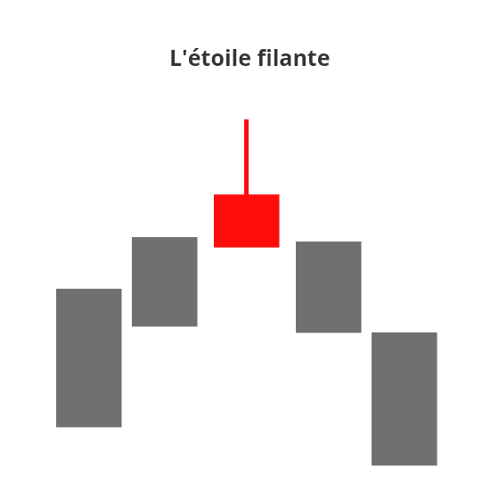

À l'inverse du marteau inversé, l'étoile filante est une **figure de retournement baissier** et prend donc tout son sens dans une tendance haussière. 

Les acheteurs contrôlent le marché, mais se voient heurtés à un réveil des vendeurs.  Si ces derniers ne parviennent pas à retourner le marché pendant la formation de l'étoile filante, ils ont néanmoins fait passer un message: les vendeurs sont de retour et ils comptent bien reprendre la main.

Ici, ce sont les acheteurs prudents (et à l'inverse, les ultra-agressifs aux stops serrés) qui sortent du marché en attendant d'avoir plus d'information. La bougie suivante sera déterminante. En cas de bougie baissière, les vendeurs prennent confiance, les stops des acheteurs sont déclenchés et la baisse se confirme. La psychologie dominante passe vendeuse et le retournement baissier à lieu.

### Les patterns à double bougies

#### Avalement haussier et avalement baissier

Une première bougie intervenant dans le sens de la tendance, immédiatement suivi par une bougie contraire, englobant la totalité de la première. Voici ce qui constituent les structures d'**avalements**. 

##### Avalement haussier

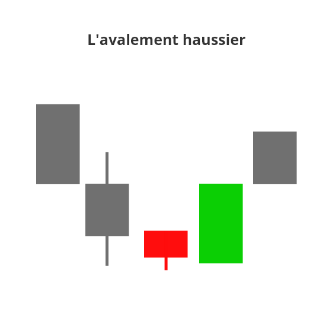

Une bougie rouge, dans une tendance baissière, immédiatement suivie par une bougie verte qui **englobe** la totalité du corps de la précédente. Une structure typique de l'**avalement haussier**.

Sur la première bougie (rouge), les vendeurs ont tenté de maintenir leur avantage et le mouvement baissier. Mais, arrivé à un certain niveau de prix, ils se sont heurtés au retour des acheteurs. Et quel retour. Non seulement ceux-ci sont parvenus à stopper la baisse, mais également à annuler complètement la dernière bougie baissière. Le sentiment dominant a changé de camp, laissant la place à un retournement haussier.

##### L'avalement baissier

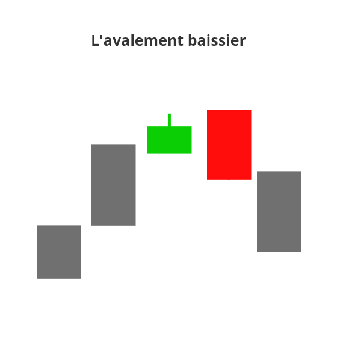

Vous l'aurez compris, l'**avalement baissier** est l'exacte inverse de son jumeau haussier. Une phase de hausse, une dernière bougie verte directement **avalée** par une bougie rouge qui marque le retour en force des vendeurs. Ici, le retournement baissier est probable et il est conseillé aux acheteurs d'attendre un peu avant de se risquer à prendre une position. 

#### Tweezer Top et Tweezer bottom

##### Tweezer Top

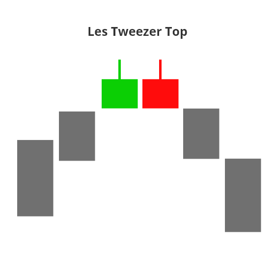

Pour identifier un Tweezer Top, quelques critères sont indispensables:

* Une tendance haussière
* Deux  bougies adjacentes de couleur différente (l'ordre des couleurs n'est pas important)
* Deux plus haut atteignant le même point

*Sur l'exemple ci-dessus, j'ai choisi d'illustrer le Tweezer Top avec deux bougies identiques mais ce n'est en rien une obligation. Le plus important étant que le point le plus haut des deux bougies se trouve au même niveau.*

Dans le cas d'un Tweezer Top, la psychologie est assez simple. Les acheteurs ont la main et poussent le marché vers le haut jusqu'à former un nouveau point haut (le plus haut de la bougie verte ici). 

Pendant la bougie suivante (la rouge ici), ils tentent de dépasser ce point pour poursuivre la hausse, mais échouent. La force n'y est plus et une résistance se crée. Voyant les forces de leurs concurrents s'amoindrir, les vendeurs se jettent sur l'occasion et reprennent la main. Le sentiment dominant s'inverse, et le marché se retourne à la baisse.

##### Tweezer Bottoms

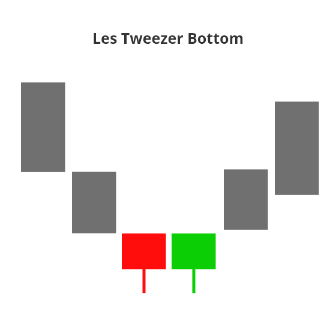

Corolaire du Tweezer Top, le Tweezer Bottom indique un changement de sentiment en faveur des acheteurs et un possible retournement haussier. Les critères (et la psychologie sous-jacente) sont les mêmes que son jumeau, à la différence que l'on cherchera deux points bas atteignant le même niveau (et donc la formation d'un support).

### Les patterns à trois bougies

Rajoutons une bougie à la recherche de nos patterns et passons à la dernière catégorie de cet article: les patterns à trois bougies. 

#### Étoile du matin et étoile du soir (Morning/Evening Star)

Une tendance, deux bougies directionnelles qui entourent une bougie d'indécision: voici l'un des patterns les plus connus du secteur: les étoiles du matin et les étoiles du soir.

##### L'étoile du matin (morning star)

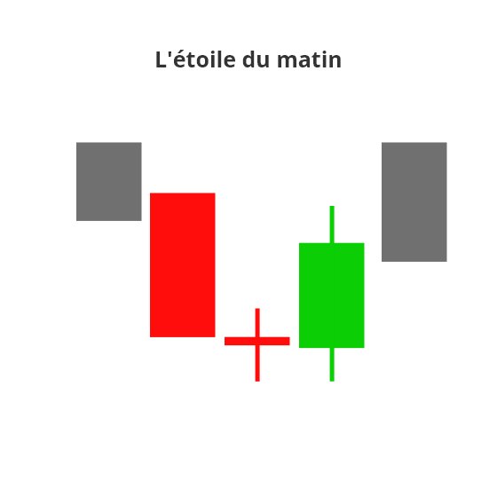

Comme tout les patterns de retournement haussier, l'étoile du matin prend place dans une tendance baissière. Alors que la baisse se poursuit (première bougie rouge), et que le sentiment vendeur semble écrasant, une bougie d'indécision fait son apparition (doji rouge ici). Les vendeurs commenceraient-ils à s'essouffler ? 

À ce moment, le marché hésite sur la tendance à suivre. Personne ne veut prendre des risques trop importants, et chacun se regarde dans le blanc des yeux. 

Durant cette phase, plus l'indécision est palpable, plus les probabilités d'un retournement est grand (et pour ça, rien ne vaut un doji). 

Finalement, après avoir hésité un moment, les acheteurs se lancent à l'assaut et prennent la main, imprimant une belle bougie verte (plus son corps est important, mieux c'est). Le sentiment de marché a changé, les vendeurs capitulent pour le moment et le retournement haussier à lieu.

##### L'étoile du soir (Evening Star)

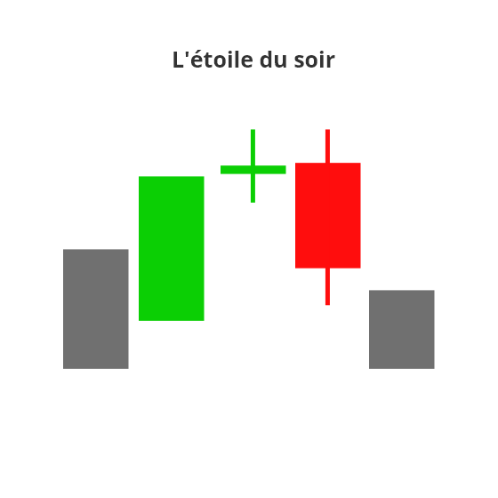

#### Trois soldats blancs et trois corbeaux noirs

Trois bougies successives de même couleur, disposant d'un gros important et de peu (ou d'aucune) ombre, voilà les structures des trois soldats blancs et des trois corbeaux noirs.

Suivant la configuration du marché, ces structures peuvent à la fois être des patterns de retournement comme de continuation d'une tendance:

* En tendance haussière: Les trois soldats blancs sont un pattern de continuation. Les trois corbeaux noirs un pattern de retournement baissier.
* En tendance baissière: Les trois soldats blancs sont un pattern de retournement haussier. Les trois corbeaux noirs un pattern de continuation.

Pour être validés, ils doivent également respecter quelques règles:

* La seconde bougie est forcément plus grande que la première.
* Les ombres sont courtes ou inexistantes.
* Les volumes sont en augmentation.

*Mais au fait, pourquoi soldats **blancs** et corbeaux **noirs** ? Si aujourd'hui, la plupart des plateformes de trading affichent par défaut les bougies haussières en vert et les bougies baissières en rouge, il fut un temps où ces couleurs étaient différentes. On utilisait alors le blanc pour les bougies haussières et le noir pour les baissières. Vous trouverez encore ces configurations de temps en temps.*

##### Les trois soldats blancs

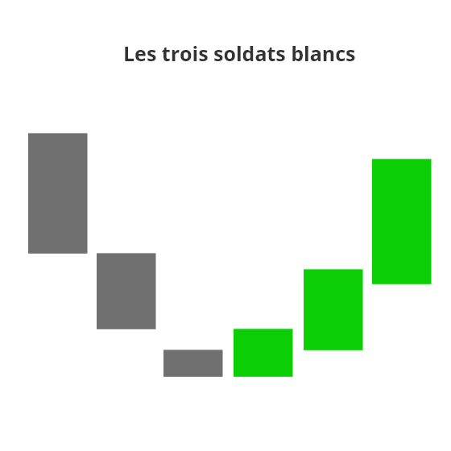

###### Dans une tendance baissière

Les trois soldats blancs apparaissent dans une tendance baissière et se matérialise par une succession de trois bougies vertes disposant de corps importants. 

Dans un contexte de marché en survente, et alors qu'un nouveau point bas a été atteint, certains acheteurs vont tenter de rentrer sur le marché pour acquérir l'actif à un prix intéressant. La phase de baisse étant mature, le marché ne trouve plus de vendeur pour tenter de freiner cette prise de contrôle et les prix se retournent sur la première bougie. 

Pris au piège de ce retournement, les vendeurs se voient obligés de racheter leurs positions, ce qui a pour effet d'accentuer la hausse et de donner le contrôle total du marché aux acheteurs. La phase baissière se termine, et le marché confirme le retournement de tendance. 

###### Dans une tendance haussière

Apparaissant dans une tendance haussière, les trois soldats blancs indiquent une continuation de la tendance. Les acheteurs ont toujours la main et confirment leur emprise sur le marché, ne laissant aucune place aux vendeurs. La hausse pourrait donc se poursuivre quelques temps. 

Mais attention, cette poussée des acheteurs pourrait bien n'être en fait qu'un dernier baroud d'honneur avant la fin. Les bulls lâchent leurs dernières forces dans la bataille, laissant penser à une prise de contrôle indéniable, avant de s'épuiser et de laisser la place.

Pour cette raison, il est préférable d'utiliser les trois soldats blancs (et leurs jumeaux les corbeaux noirs) comme indicateur de retournement de tendance plutôt que de continuation (donc rechercher les trois soldats dans une tendance baissière et les trois corbeaux dans une tendance haussière).

##### Les trois corbeaux noirs

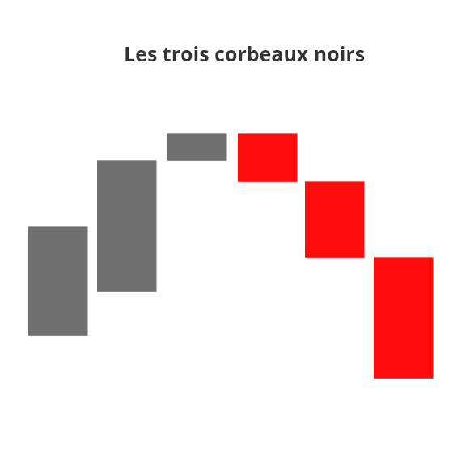

Jumeaux maléfiques des soldats blancs, les trois corbeaux noirs se matérialisent par une succession de trois bougies rouges. 

Dans un contexte de marché en sur-achat, et alors qu'un nouveau point haut à été atteint, certains vendeurs vont tenter de rentrer sur le marché. La phase de hausse étant mature, le marché ne trouve plus d'acheteurs pour tenter de freiner cette prise de contrôle et les prix se retournent sur la première bougie. 

Pris au piège de ce retournement, les acheteurs clôturent leurs positions (ou voient leurs stops se déclencher), ce qui a pour effet d'accentuer la baisse et de donner le contrôle total du marché aux acheteurs. 

La phase haussière se termine, et le marché confirme le retournement de tendance. 

A la manière des trois soldats blancs, les trois corbeaux noirs peuvent également apparaitre dans une tendance baissière déjà établie, et sont alors le signe d'une continuation de tendance à venir. Mais ici aussi,  l'on préfèrera utiliser ce pattern comme potentiel indicateur de retournement (donc dans une tendance haussière), à cause des risques d'essoufflement de la continuation. 

#### Les trois Inside Up et les trois Inside Down

Figures de retournement, les Trois Inside prennent place dans une tendance déjà bien établie. Ils se composent de la façon suivante:

- Une première bougie dans le sens de la tendance
- Une seconde bougie, dans le sens inverse à la tendance, plus petite et contenue dans le corps de la précédente . 
- Enfin, une dernière bougie, plus grande que la seconde et toujours dans le sens inverse de la tendance, qui vient clôturer plus haut que la première.

##### Trois Inside Up

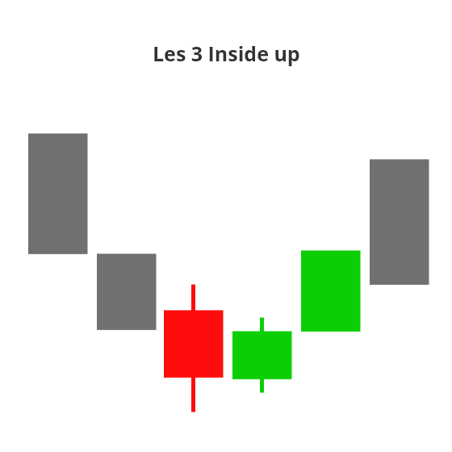

Première bougie (rouge): Les vendeurs ont le contrôle du marché et poussent les prix vers le bas, sans trouver en apparence d'adversaires pour les stopper. 

Seconde bougie (verte): Soudainement, les acheteurs se réveillent et parviennent à contenir la baisse. Mieux, ils récupèrent une partie du terrain perdu. Pour les vendeurs, c'est le signal qu'il est temps de prendre leurs profits et de se faire la malle. 

Troisième bougie (verte): Avec le retour des acheteurs et le départ des vendeurs prudents, le déséquilibre change de camp. Les acheteurs prennent la main, poussant les prix vers le haut en déclenchant les stops de vendeurs un peu trop joueurs, pris au piège par le retournement. Le marché se renverse, et est prêt pour une phase haussière.

##### Trois Inside Down

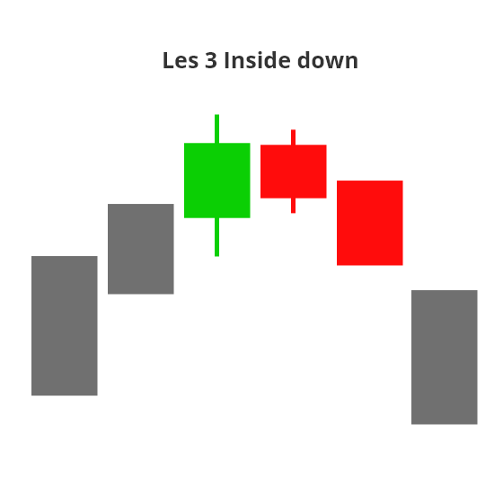

Première bougie (verte): Les acheteurs ont le contrôle du marché et poussent les prix vers le haut, sans trouver en apparence d'adversaires pour les stopper. 

Seconde bougie (rouge): Soudainement, les vendeurs se réveillent et parviennent à contenir la baisse. Mieux, ils récupèrent une partie du terrain perdu. Pour les acheteurs, c'est le signal qu'il est temps de prendre leurs profits et de se faire la malle. 

Troisième bougie (rouge): Avec le retour des vendeurs et le départ des acheteurs prudents, le déséquilibre change de camp. Les vendeurs prennent la main, poussant les prix vers le haut en déclenchant les stops d'acheteurs un peu trop joueurs, pris au piège par le retournement. Le marché se renverse, et est prêt pour une phase baissière.

## Conclusion

Nous avons vu ici les patterns les plus classiques des bougies japonaises, mais il en existe bien d'autres sur le marché. Ceux évoqués ici sont simplement les plus courants et savoir les reconnaître vous donnera déjà une bonne base pour commencer à interpréter le marché.

Si retenir l'ensemble de ces patterns peut être intimidant à première vue, rassurez-vous, avec le temps, vous apprendrez à les repérer d'un coup œil. En attendant, mon conseil est le suivant: ouvrez un graphique au hasard, et remontez le temps en analysant les bougies. Vous découvrirez vite certains des patterns évoqués ici même, et vous habituerez votre cerveau à les débusquer.

Pour conclure, je vous conseillerais également de tenter de regarder vos graphiques d'un œil différent. Au lieu de vous concentrer sur le prix, cherchez à deviner la psychologie du marché. Comment les bougies s'enchaînent-elles ? Les corps sont-ils importants ou au contraire réduits ? Quand aux ombres, à quoi ressemblent-elles ? Et plus important encore, que pouvez vous en déduire sur le rapport de force entre acheteurs et vendeurs, et donc sur le sentiment dominant ? 

Ces informations sont précieuses, souvenez vous que ce rapport de force représente l'essence même du marché. Être capable de le comprendre, c'est se donner un léger avantage, de celui qui fait la différence entre une bonne et une mauvaise décision.    