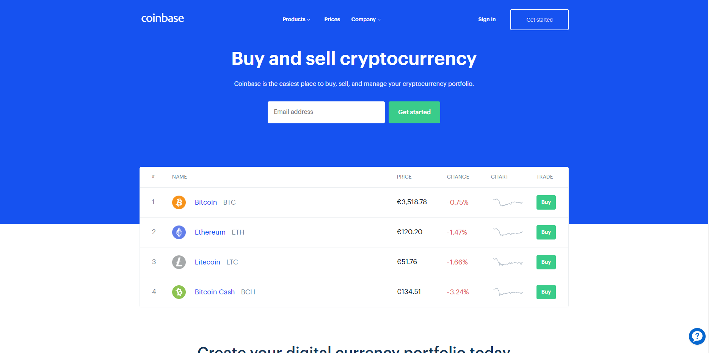
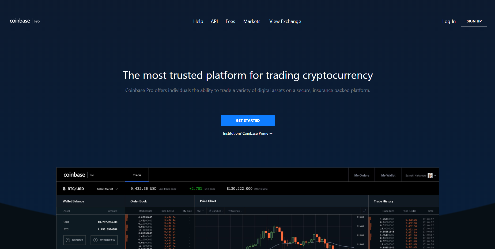
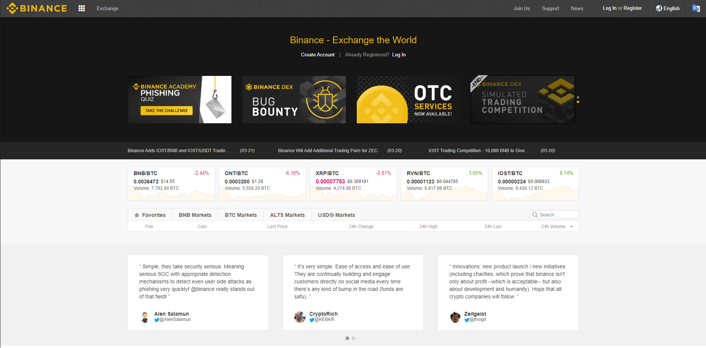
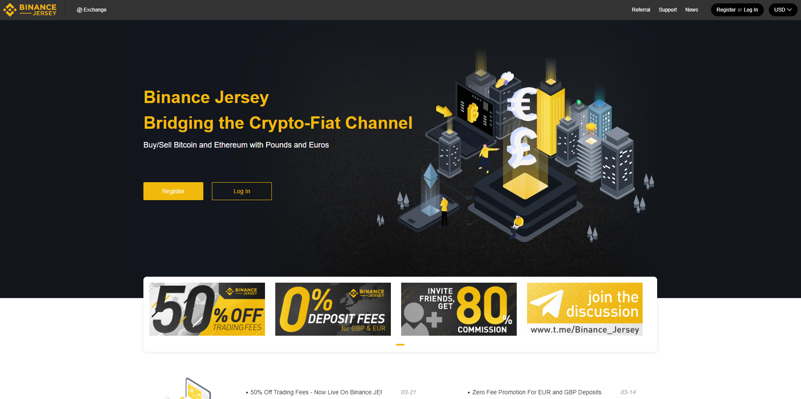
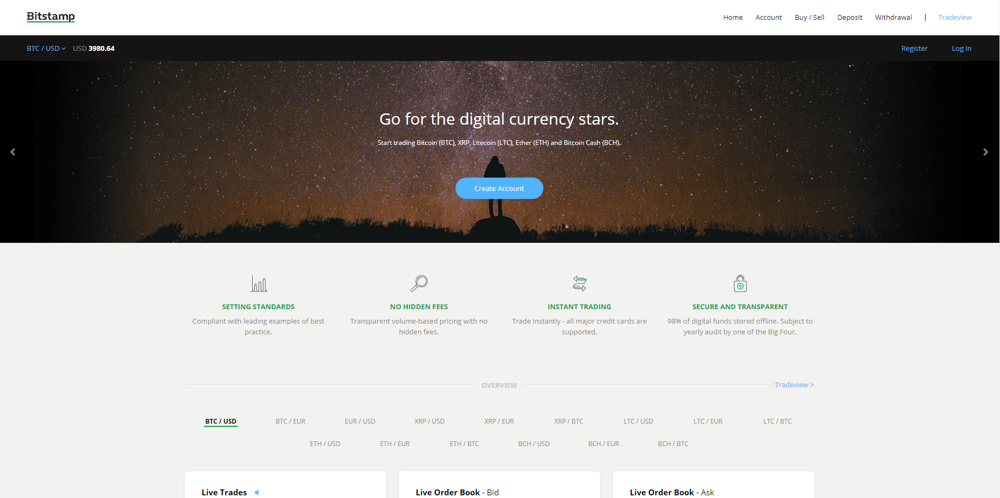
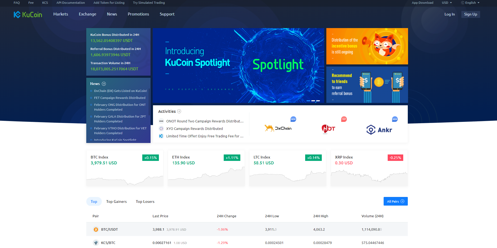

Alors que les crypto-monnaies deviennent chaque jour un peu plus populaires, le nombre d'exchanges présents sur le marché explose. Ils se comptent aujourd'hui par dizaines et faire le tri n'est pas toujours évident. Pour vous aider à faire un choix, passons en revue les 5 meilleurs exchanges pour commencer à trader les cryptos lorsque l'on débute.

Mais d'abord, qu'est-ce qu'un exchange exactement, et à quoi servent-ils ?

## Qu'est ce qu'un exchange ?

Un exchange est une place de marché. Il agit comme un intermédiaire entre acheteurs et vendeurs, simplifiant ainsi la réalisation des transactions. Si vous avez déjà (ce qui est probable) acheter un article chez un vendeur tiers Amazon, le principe est le même.

Les exchanges peuvent être classés en deux grandes catégories, ceux permettant les transactions en fiat (ou monnaies fiduciaires dans la langue de Molière, soit l'euro, le dollar ...) et ceux ne traitant que les transactions de cryptos à cryptos. 

Pour débuter, je vous conseille vivement de vous concentrer dans un premier temps sur le trading de paires fiat/crypto afin de vous faciliter la vie et de ne pas avoir à jongler en permanence entre les cours.

## Comment bien choisir son exchange ?

Le choix d'un exchange n'est pas anodin. N'oubliez pas que vous allez lui confier votre argent. Certaines vérifications sont donc de mise avant d'y envoyez vos fonds. De plus, certains facteurs, comme le montant des frais, peuvent largement varier d'un exchange à un autre. Avant de se lancer, vérifier donc:

- **La réputation de l'exchange** : Prenez quelques minutes pour faire quelques recherches sur l'exchange en question. Quels sont les avis des utilisateurs ? Est-il présent sur le marché depuis longtemps ? Vérifier également son historique sur sa page Wikipédia. A-t-il été victime d'un hack récemment ? Si oui, passez votre chemin pour le moment. Vous pouvez également aller lire les commentaires à son sujet sur Reddit ou Bitcointalk, ou même y posez vos questions. 

- **Les méthodes de paiement disponibles**: Vérifiez les méthodes de paiement acceptées par l'exchange. Pouvez-vous transférer vos fonds par virement SEPA ? Par Paypal ? L'exchange accepte-t-il les paiements par CB ? Dans le cas des exchanges ne traitant que les paires crypto/crypto, seuls les transferts de crypto sont en général acceptés, ce qui vous obligera à passer pour un second service au préalable (pour acheter vos crypto avant de les transférer vers l'exchange en question).

- **Les procédures de vérifications**: La majorité des exchanges vous demanderons de vérifier votre identité avant de pouvoir les utiliser. Si ces procédures peuvent sembler pénibles, elles sont malheureusement nécessaires dans la lutte contre le blanchiment d'argent. Les délais sont en général assez rapides, ils peuvent devenir assez longs (plusieurs jours, voir semaines) quand l'afflux de nouveaux inscrits est conséquent. Il est donc préférable de procéder aux inscriptions et de lancer les vérifications dès que possible, même si vous ne prévoyez pas d'investir immédiatement.

- **Les frais**: En fonction des exchanges, le montant des frais peut énormément varier. Présence ou non de frais de dépot, montant des frais de retrait et des frais de transactions... prenez un moment pour comparer les coûts. Ces derniers peuvent avoir une grande incidence sur votre profitabilité future. La plupart des exchanges ont une page dédiée à ce sujet, n'hésitez pas à la consulter.

- **Les cryptos disponibles:** Certains exchanges se concentrent sur les crypto majeures (à savoir celles avec le plus gros market cap), d'autres vous proposeront un panel bien plus large. 

- **Les volumes**: Ils représentent le montant cumulé des transactions ayant eu lieu sur l'exchange (en général sur 24h). Plus les volumes sont élevés, plus le marché est liquide et plus vous aurez de chance de trouver quelqu'un pour acheter ce que vous avez à vendre (ou vendre ce que vous avez à acheter). Si vous hésitez entre deux exchanges comparables, préférez toujours celui offrant les volumes les plus importants.

## Les meilleurs exchanges pour commencer le trading de crypto

Vous trouverez ici une liste des exchanges les plus adaptés pour vous lancer. Cette sélection drastique a été faite en fonction d'un certain nombre de critères comme la sécurité, la réputation, l'accessibilité ou encore le fait d'avoir moi-même utilisé le service en question. 

J'ai donc exclu de nombreux exchanges, principalement pour des raisons de volumes insuffisants, de réputation douteuse (oui Bitfinex, c'est de toi dont je parle) ou de pratiques discutables. 

**Avertissement important:** 

A moins que vous ne vous lanciez dans le trading court-terme (day trading ou scalping), ne laissez pas vos cryptos sur un exchange. Quel qu'il soit. Rien ne garantit qu'un service, jusqu'ici totalement sûr, ne sera pas victime d'un hack demain. 

Si vous prévoyez de garder vos cryptos pendant plusieurs jours (ou plus), transférez les sur un wallet externe. Vous pouvez optez pour des logiciels comme Exodus, ou mieux, faire l'acquisition d'un hardware wallet comme le [Ledger Nano](https://www.ledger.com?r=6ce75229a486), qui vous garantira une sécurité supplémentaire. Cette mécanique de transfert est certes ennuyeuse et un peu coûteuse mais elle n'est rien comparé au risque de perdre votre capital si un hack venait à survenir.

## Coinbase et Coinbase Pro

Impossible de parler d'exchange sans mentionner [Coinbase](https://www.coinbase.com/join/577e83861d697a795c000bb6). Utilisé par des millions d'utilisateurs, disposant d'une assurance sur ses fonds et présent sur le marché depuis 2012, Coinbase est un incontournable de l'univers crypto et à largement contribuée à faire connaître Bitcoin et les cryptos au grand public.

Avec son interface limpide et la possibilité d'acheter directement ses crypto par CB ou PayPal, Coinbase est la porte d'entrée habituelle des nouveaux arrivants sur le marché. 

Si Coinbase n'est pas exactement un exchange, le service est directement relié à Coinbase Pro.

Anciennement GDAX, Coinbase Pro est la plateforme de trading associée à Coinbase. Spécifiquement conçue pour les traders particuliers, Coinbase Pro vous permet d'acheter ou de vendre un certain nombre de crypto-monnaies sans avoir à devoir supporter les frais de Coinbase à chaque opération.

En effet, si vous décidez d'acheter et de revendre du Bitcoin (ou d'autres monnaies disponibles chez Coinbase) régulièrement pour profiter des mouvements du marché, les frais inhérents au service pourraient bien avoir raison de vos profits. 

Il est alors bien plus intéressant de migrer ses fonds vers Coinbase Pro pour effectuer ses opérations et de profiter de frais bien plus réduits (0.15% de moyenne).

En quelques clics depuis votre compte Coinbase, vous pourrez transférez vos cryptos et commencer à trader en disposant de tous les outils nécessaires.

Une question revient régulièrement à propos de la différence Coinbase / Coinbase Pro: lequel utilisé ?

 Si vous souhaitez investir sur le long terme: vous pouvez rester sur Coinbase. Idem si vous comptez garder vos trades sur de longues durées (plusieurs jours ou plusieurs semaines). Si, par contre, vous souhaitez vous lancer dans le day trading, préférez Coinbase Pro afin d'éviter de voir vos gains annihilés par les frais.

**Avantages**: Excellente réputation, sécurité sans faille, fonds assurés en cas de hack, très accessible aux débutants, historique, possibilité d'acheter ses crypto par CB.

**Inconvénients**: Frais élevés, nombre de crypto limité, politique discutable sur la gestion de la vie privée de ses utilisateurs.

**A choisir si:** Vous souhaitez faire vos premiers achats de crypto par CB et/ou commencer le trading de manière simple et sécurisé.

**Conclusion:** 

Si l'on ne devait retenir qu'un seul et unique service dans toute la crypto-sphère, ce serait sans aucun doute [Coinbase](https://www.coinbase.com/join/577e83861d697a795c000bb6). Certes ses frais ne sont pas les moins élevés du marché, mais sa simplicité d'utilisation, sa sécurité et son historique font de lui un incontournable lorsque l'on parle d’acheter du Bitcoin et des crypto-monnaies.

Si vous êtes un nouveau venu dans le monde des cryptos et que vous ne souhaitez pas investir une fortune dans ce nouvel univers, Coinbase est le choix tout trouvé (lorsque l'on commence à parler de gros montants, des services comme Kraken ou BitStamp peuvent devenir plus intéressants en raison de leurs frais bien plus faibles).

**Notes:** Vous pouvez bénéficier de 8€ bonus pour 88€ d'achat en passant par ce [lien](https://www.coinbase.com/join/577e83861d697a795c000bb6).

## Kraken

Fondé en 2011 à San Francisco, [Kraken](https://www.kraken.com) est un l'un des plus ancien exchange de crypto-monnaies encore en activité. Au fil des années, il est parvenu à se construire une solide réputation en terme de sécurité et à devenir l'un des principaux exchanges du marché. Il occupe d'ailleurs aujourd'hui la première place en terme de volume d'échange euro/bitcoin.

Contrairement à Coinbase, [Kraken](https://www.kraken.com) oblige ses utilisateurs à déposer leur fonds via virements bancaires. Il vous faudra donc passer par le traditionnel virement SEPA (si vous êtes dans la zone européenne) afin de créditer votre compte et de pouvoir acquérir vos premières crypto-monnaies.

Côté frais, aucun frais de dépôt ne vous sera facturé lors du transfert SEPA (10€ si vous passez par un transfert Wire) et les frais de trading restent tout à fait raisonnables dans le cadre d'un trading moyen/long terme. Comptez 0.2% de commission en moyenne lors de chaque transaction. 

Si la plateforme à connu de nombreux déboires techniques lors de la folle affluence de 2017, elle semble avoir fait le travail nécessaire pour assurer sa stabilité. Malgré tout, un doute subsiste encore sur sa capacité à supporter de lourdes charges de trafic. 

**Avantages:** Excellente sécurité et bonne réputation, possible d'y trader en euro, frais de transactions raisonnables et support client réactif.

**Inconvénients:** Interface relativement complexe, virements uniquement, nombre de crypo disponibles limité, sujet à des problèmes techniques en cas de forte affluence.

**A choisir si:** Vous cherchez un service tout en un, vous offrant à la fois la possibilité de transférer vos fonds via virement SEPA, la possibilité de trader les crypto majeures, tout en disposant d'options de trading avancées (short, margin trading...).

**Conclusion:** 

Si Coinbase est souvent la première étape pour les nouveaux entrants de la crypto-sphère, [Kraken](https://www.kraken.com) est sans conteste le second pas à franchir. Frais acceptables, excellente sécurité, présence des principales cryptos et accès à l'ensemble des outils et options nécessaires aux traders, Kraken est sans conteste l'une des solutions envisageable si vous désirez vous lancer dans le trading pur et dur ou si vous avez un investissement conséquent à réaliser.

## Binance

Relativement récent, [Binance](https://www.binance.com/?ref=11606170) rapidement devenue **The place to be** lorsque l'on parle de crypto trading. Supportant une large variété de token, offrant une politique de frais particulièrement intéressante et permettant de se lancer dans le trading sans vérification préalable, [Binance](https://www.binance.com/?ref=11606170) est une option de choix si vous souhaitez trader de crypto à crypto.

Seul exchange de la liste vous permettant de commencer à trader sans vérification préalable (jusqu'à 2 BTC de retrait quotidien), Binance a également la particularité de disposer de sa propre crypto, le Binance Coin (ou BNB). Un token qu'il est possible d'utilisé pour réduire drastiquement les frais de la plateforme (50% de frais en moins). Malgré tout, étant donné les frais tout à fait raisonnables de Binance (0.1%), son utilisation restera réservé aux traders confirmés ou à ceux voulant se tourner vers du trading court-terme.

Côté sécurité, Binance a rapidement gagné la confiance des utilisateurs. En déjouant, en mars 2018 une tentative de hack avant qu'il ne survienne (au final, seuls les hackers auront perdu leur argent dans l'histoire), elle a prouvé son sérieux et la solidité de ses processus de sécurité. 

Si trader en euro ou en dollar n'a pas d'importance pour vous, et que vous souhaitez vous ouvrir un maximum de possibilité, ne cherchez plus, **[Binance](https://www.binance.com/?ref=11606170) est fait pour vous**. 

### Binance Jersey

Début 2019, Binance a lancer une nouvelle plateforme, destiné à renforcer sa position sur le marché européen: [Binance Jersey](https://www.binance.je). Celle-çi vous permet de trader Bitcoin et Ethereum directement en euro, tout en bénéficiant des avantages de Binance (interface, réputation et sécurité notamment). Si vous souhaitez trader sur une plateforme conforme aux régulations européennes et que vous limitez aux deux cryptos leader ne vous dérange pas, Binance Jersey pourrait être une alternative à considérer.

**Avantages:** Bonne réputation, frais minimes, possibilité de retirer jusqu'à 2 BTC par jour sans vérification d'identité, très grand nombre de crypto disponibles, accessible au débutant, présence d'une application mobile pour iOS et Android.

**Inconvénients:** Crypto à crypto uniquement, ni *short* (vente à découvert) ni *margin trading*, pas de fiat.

**A choisir si:** Vous voulez vous lancer dans le trading de paires crypto/crypto et/ou investir sur un large nombre de tokens. 

**Conclusion:** Avec ses frais minimes et sa grande variété de cryptos disponibles, Binance est rapidement devenu l'un des exchanges préférés des traders, tant débutants que novices. En évitant tout impairs, la plateforme poursuit, depuis sa création, une ascension fulgurante et l'on ne voit pas ce qui pourrait l'arrêter. 
Ni ce qui pourrait vous empêcher de la tester si vous chercher à investir sur un large panel de crypto. Seule vrai ombre au tableau, l'impossibilité de shorter le marché, une limite parfois agaçante que l'on aimerait voir disparaître afin de gagner encore un peu plus en liberté.

## Bitstamp, un exchange européen

Opérant sur le marché depuis 2011, [Bitstamp](https://www.bitstamp.net) fait parti de la vieille garde des exchanges de crypto-monnaies. Concentrée à l'origine sur le marché européen, la plateforme slovène est devenue au fil des années l'un des services les plus populaires au monde à la fois pour l'achat et le trading de crypto.

Coté frais, comptez 5% du montant de l'achat si vous choisissez de passer par un paiement par CB. On préfèrera donc passer par le traditionnel virement SEPA, un peu plus long certes, mais gratuit. Les frais de transactions se chiffrent quand à eux à 0.25% par transaction (0.10% en cas de volume supérieur à $20 000 mensuel).

Niveau sécurité, la plateforme à la réputation d'être un exchange particulièrement fiable. Une confiance que [Bitstamp](https://www.bitstamp.net) a dû regagner au prix de nombreux efforts. En effet, le service a eu à souffrir de plusieurs piratages au cours de son histoire (en 2014 et 2015). Suite à ces hacks, l'équipe derrière Bitstamp a décidé de renforcer leurs procédures de sécurité et d'opter pour des mesures drastiques. Ainsi, à la manière de Coinbase, 98% des fonds sont conservés hors-ligne, les rendant totalement inaccessibles à toute tentatives de piratage. 

Bitstamp a également choisi de faire assurer l'ensemble de ces fonds par une compagnie new-yorkaise, garantissant ainsi à ses clients une certaine tranquillité d'esprit.

Les procédures d'authentification ont également été grandement sécurisées, avec l'introduction du 2FA (authentification à deux facteurs), d'emails et de SMS de confirmation et l'utilisation généralisé du PGP pour encrypter la totalité des fichiers utilisateurs.

Depuis 2015 et l'introduction de ces nouvelles mesures de sécurité, aucun nouvel incident n'a été à déplorer et l'on peut estimer sans risque que [Bitstamp](https://www.bitstamp.net) soit devenu l'un des exchanges les plus sécurisé du marché. 

**Avantages:** Sécurité, service client réactif, frais réduit, excellente réputation.

**Inconvénients:** Nombre de cryptos limités

**A choisir si:** Vous voulez vous concentrer sur le trading des crypto majeures dans un environnement sécurisé. 

**Conclusion:**  Le moins que l'on puisse dire, c'est que l'histoire de BitStamp n'a pas été de tout repos. La plateforme européenne a subit de nombreux remous lors de ses premières années d'existence et a été obligé de se remettre fortement en question afin de regagner la confiance de la crypto-sphère.

Des efforts largement récompensés, puisque BitStamp jouit aujourd'hui d'une excellente réputation et d'un des meilleurs taux de satisfaction du marché. Si l'on pourra regretter le léger manque de diversité de son offre, avec seulement cinq crypto disponibles, le reste est un quasi sans-faute. Service client réactif, sécurité renforcée, interface limpide et frais réduits font de [BitStamp](https://www.bitstamp.net) une alternative plus que crédible aux leaders du marché.

## Kucoin, une alternative possible à Binance

Autant faire court, tout comme Binance, [Kucoin](https://www.kucoin.com) :

* est basé à Hong Kong
* a été créé en 2017
* propose des frais ultra réduits (0.1%)
* se concentre sur le trading de crypto à crypto et propose un large panel de token (un peu moins que Binance cependant)
* dispose de sa propre crypto interne, vous permettant de réduire les frais  
* n'a jamais subis de hack de grande ampleur (mais on trouve des témoignages à droite à gauche d'utilisateurs victimes de piratages)

L'exchange possède malgré tout un avantage certain par rapport à son concurrent direct: un service client réactif et contactable par chat 24/24h. 

**Avantages:** C'est comme Binance mais avec un service client plus performant

**Inconvénients:** C'est comme Binance, mais avec des volumes bien plus faibles

**A choisir si:** Vous cherchez un exchange comme Binance mais avec la possibilité de contacter un service client à n'importe quel moment.

## Un seul pour les gouverner tous

Choisir son exchange est une chose importante, et les facteurs de décision sont nombreux. Malgré tout, n'oubliez pas que rien ne vous oblige à limiter votre choix à une seule et même plateforme. Pour conclure cet article et illustrer ce propos, je vais donc vous partager ici ma propre utilisation:

J'ai commencé (comme tout le monde ou presque) sur Coinbase. Si vous débutez, je vous conseille de faire de même, c'est le plus simple pour se lancer.

Aujourd'hui, je trade les paires majeures (BTC, ETH, XRP...) en monnaie Fiat sur Kraken, avec un compte Bitstamp en backup au cas où Kraken soit à nouveau sujet à des problèmes de stabilité. Pour le trading de crypto à crypto, j'utilise Binance, qui répond parfaitement à mes besoins. 

Je ne garde sur les exchanges que les actifs que je réserve au day-trading, si je sais qu'un trade va s'étendre sur plusieurs jours, je transfère les coins directement sur mon Ledger ou sur un sofware wallet (dans le cas où le token n'est pas pris en compte par le Ledger).

Enfin, j'utilise [Coinigy](https://www.coinigy.com) pour gérer la totalité de mes trades. Ce service externe utilise les API des exchanges pour vous permettre de regrouper en un seul et même endroit vos différents comptes de trading. Pour un coût raisonnable (une petite quinzaine d'euros mensuels), je n'ai plus à jongler entre les différentes plateformes et peut passer mes ordres depuis une interface unique. Pas forcément indispensable c'est certain, mais particulièrement agréable. 

## Les exclus de cette liste

Il existe des centaines d'exchanges sur le marché, la plupart n'ayant, soyons clair, pas le moindre intérêt. Cependant, certains des plus gros acteurs du marché ont été exclus de cette liste:

* **Bitfinex**. Parce que ... Bitfinex. Oui il reste l'un des incontournables (encore que aujourd'hui), mais c'est aussi l'un des plus sulfureux. Il est possible de l'utiliser, mais il faut avoir conscience des risques encourus.
* **Bittrex**. Il a été mon exchange principal pendant des années. Mais la qualité de son service client, les suspicions de hacks et les fermetures de comptes arbitraires dont on peut trouver nombre de témoignages sur le net ont eu raison de lui. Si je n'ai jamais eu à m'en plaindre personnellement, je ne le conseillerai pas aujourd'hui.
* **BitMex**. Un cas un peu particulier. Si son utilisation peut avoir des avantages, il est aussi notoirement connu pour avoir une fâcheuse tendance à mystérieusement suspendre ses services lors des mouvements importants de marché. Plumant au passage une partie de ses utilisateurs, dans l'incapacité de réagir. Bref, non merci.
* **Poloniex**. Un vieux de la vieille. Mais qui n'a aucun avantage notoire par rapport à la concurrence aujourd'hui.
* **Changelly**. Pas vraiment un exchange mais une sorte d'agrégateur qui vous sert d'intermédiaire avec des exchanges classiques pour acheter au meilleur prix, moyennant 0.5% de frais. Pourquoi pas. Je ne l'ai jamais utilisé personnellement, d'où son absence ici.
* **Coineal, OKEx, BW.com, Bibox...** et tous les nouveaux exchanges présents sur le marché et qui trustent aujourd'hui les premières places en volume. Je ne les ai jamais utilisés et leurs historiques sont encore trop faibles pour pouvoir les juger réellement. 

Il est possible (et même probable) que j'ai oublié certains acteurs incontournables. 
Si c'est le cas, n'hésitez pas à le mentionner en commentaire, afin de compléter cet article. 

N'hésitez pas non plus à partager vos expériences. Quel exchange utilisé vous aujourd'hui ? Ou si vous êtes novice, vers lequel comptez vous vous tournez ?

 

   

