**💰 8€ offerts lors de vos premiers achats de cryptos sur [Coinbase](https://www.coinbase.com/join/577e83861d697a795c000bb6) 👈 ! 💰**

## Qu'est-ce que Coinbase ?

**Coinbase** est un service en ligne servant à la fois de portefeuille de devises numériques (wallet) et de place de marché (exchange) basé à San Francisco. 

Fondée en 2012 par Brian Armstrong, Fred Ehrsam (ancien trader de chez Goldman Sachs) et Ben Reeves (co-fondateur de blockchain.info), l'entreprise californienne compte aujourd'hui plus de 20 millions de clients, répartis dans une trentaine de pays à travers le globe.

## Pourquoi utiliser Coinbase ?

La grande force de Coinbase tient dans sa **simplicité d'utilisation**, ce qui fait du service l'une des portes d'entrées préférées des nouveaux arrivants dans l'univers crypto. À contrario de certains exchanges où la navigation peut s'avérer complexe, Coinbase se veut accessible et facilement compréhensible. 

Une politique d'ouverture au plus grand nombre qui fait du service l'un des leaders actuels du marché en terme de nombre d'utilisateurs. 

L'autre avantage de Coinbase, c'est sa large variété de moyens de paiement disponibles. Alors que bon nombre d'exchanges n'acceptent que les virements bancaires comme moyen de dépôt, Coinbase vous offre la possibilité d'acheter des cryptomonnaies directement depuis votre carte bancaire. 

*Il est également possible d'y utiliser Paypal, mais uniquement dans le sens des retraits (**impossible donc de virer l'argent stocké sur votre compte Paypal sur Coinbase**)*.

## Comment s'inscrire sur Coinbase ?

Pour ouvrir un compte sur Coinbase, rendez-vous sur [coinbase.com](https://www.coinbase.com/join/577e83861d697a795c000bb6) et cliquez sur le bouton "**Get started**", en haut à droite de votre écran (si vous ne parlez pas anglais, pas d'inquiétude, nous passerons le site en français dès l'inscription terminée).

_Note: Le lien ci-dessus est un lien d'affiliation, celui vous vous permettra de bénéficier de **8€ bonus pour 88€ d'achat**._

*Conseil*: Avant de commencer, si vous procédez à l'inscription depuis un PC (ou un mac) et que vous ne disposez pas de webcam, munissez vous d'un scan (ou de photos) de votre passeport ou des deux faces de votre carte d'identité, vous en aurez besoin bientôt. 

Si vous disposez d'une webcam (de bonne qualité) ou que vous procédez à l'inscription depuis votre mobile, vous pouvez sautez cette étape.

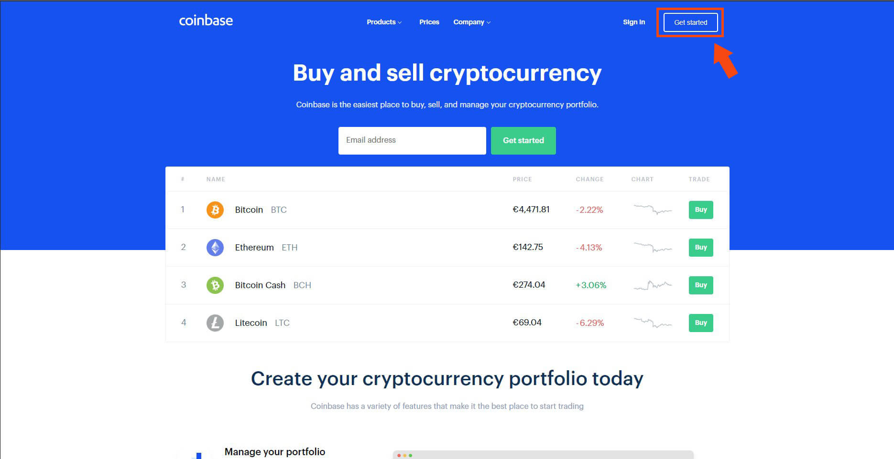

Entrer vos informations, incluant votre prénom (First Name), votre nom (Last name), votre email et votre mot de passe (**n'oubliez pas d'utiliser un password sécurisé**). Cochez la case qui confirme que vous avez plus de 18 ans (si vous êtes mineur, désolé mais il ne vous sera pas possible d'utiliser le service) et que vous acceptez les conditions d'utilisation du service et cliquez sur "**Create account**".

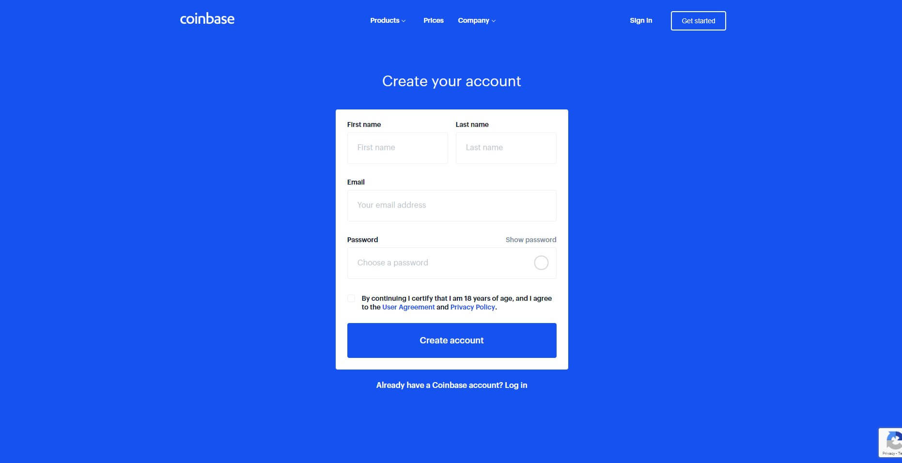

L'écran suivant vous informe que Coinbase se conforme au RGPD, cliquez sur "**next**".

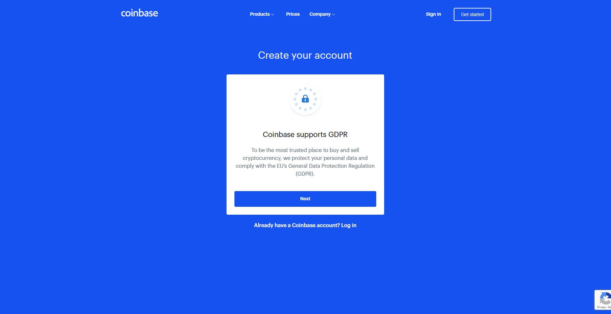

Coinbase vous proposera ensuite de vous abonner à leur newsletter. À vous de voir si vous souhaitez recevoir ou non des emails réguliers. Cliquez sur "Yes" ou "No" en fonction de vos préférences.

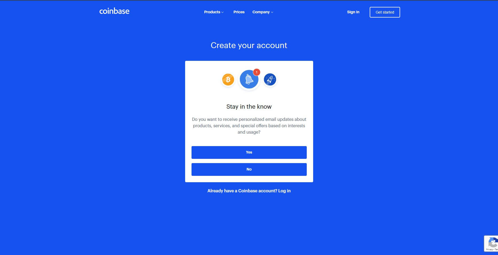

Vous aurez ensuite droit à la petite phase de captcha servant à vérifier que vous êtes bien un utilisateur humain (à moins, comme je le soupçonne, que ce ne soit une invention créée avec la ferme intention de vous rendre fou).

Une fois le captcha vérifié, un email de confirmation sera envoyé à l'adresse que vous avez indiquée. Ouvrez le et **cliquez sur le lien de confirmation** qu'il contient, ce qui vous permettra de passer à l'étape suivante du processus.

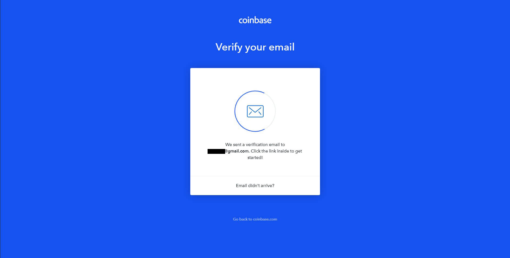

On passe à la vérification téléphonique. Entrez votre numéro de mobile, **sans le 0 initial** et cliquez sur "**Send Code**".

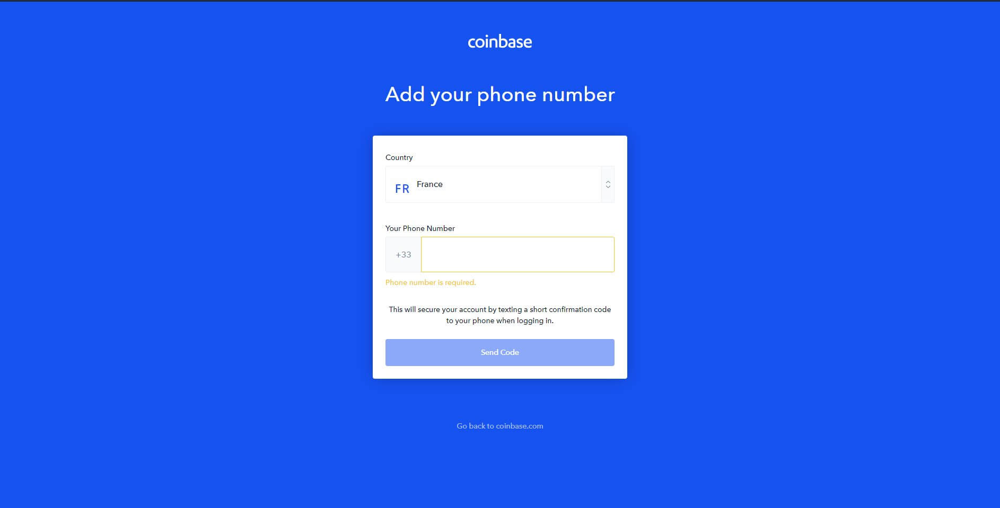

Un message a dû arriver sur votre téléphone, celui-ci comporte un code à 7 chiffres. Entrez les dans le champ approprié et cliquez sur "**Submit**" (si vous n'avez pas reçu le message au bout de quelques minutes, vous pouvez le renvoyer en cliquant sur "Re-send SMS", voir changer de numéro en cliquant sur "Use another phone number").

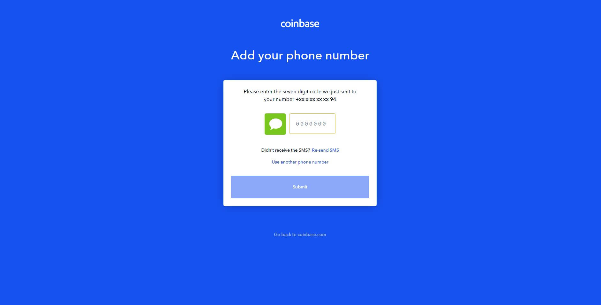

On y est presque, plus qu'une étape majeure et votre compte sera enfin prêt à être utiliser. Mais avant, il va falloir passer par la case KYC.

## La vérification de votre identité, le KYC

Parvenu à cette étape, il va falloir apporter à Coinbase la **preuve de votre identité**. Si vous vouliez de l'anonymat, désolé mais c'est raté.

Remplissez les champs suivants avec vos informations:

* First name (Prénom)
* Last Name (Nom)
* Date of Birth (Date de naissance)
* Street Address (Adresse)
* City/Town (Ville)
* Post code (Code postal)
* Country (Pays, sélectionné automatiquement en principe)

Pour le reste des champs de droite, rien ne vous oblige à dire la vérité. 

Le premier "What will you use Coinbase for ?" vous demande de quelle manière vous allez utilisez le service (Trading ou Investissement fera très bien l'affaire). 

Le second "What is your source of funds ?" cherche à savoir d'où provient votre argent. 

Le troisième "Current Occupation" porte sur le secteur d'activité dans lequel vous travaillez actuellement (mettez ce que vous voulez) et le dernier "Employer" vous demande d'indiquer le nom de votre employeur (n'importe quelle suite de lettre aléatoire fonctionnera très bien ici).

Une fois ceci rempli, cliquez sur "**Continue**".

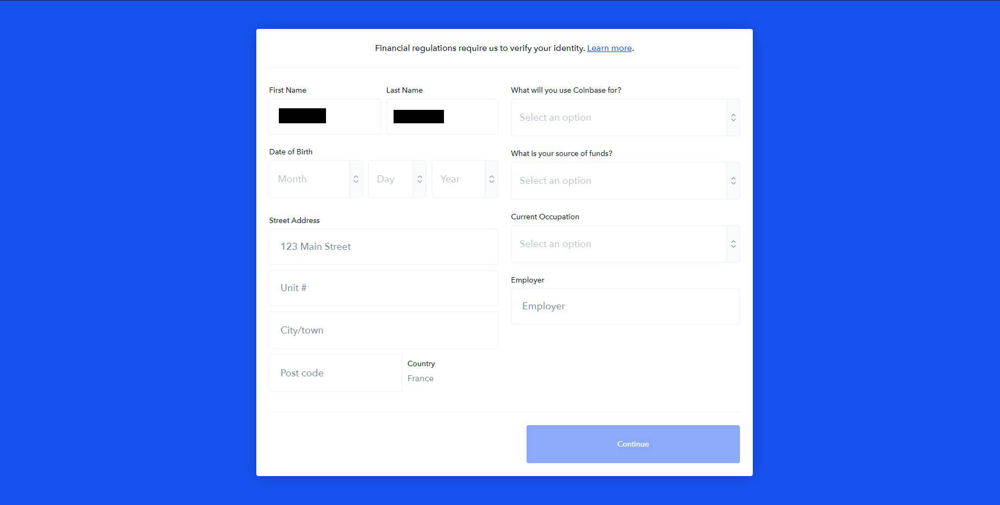

Courage, il ne reste plus qu'une seule et unique étape avant d'avoir enfin un compte actif. 

Mais avant, il va falloir fournir à Coinbase la preuve que vous ne lui avez pas menti sur votre identité. 

Choisissez le type de papiers officiels que vous souhaitez utiliser (dans l'ordre passeport, permis de conduire et carte d'identité) et uploadez les documents correspondants. Un scan couleur ou une photo prise avec votre smartphone fera très bien l'affaire (assurez vous cependant que les informations soient clairement lisibles). 

Si vous disposez d'une webcam, ou que vous procédez à l'inscription depuis un mobile, vous pouvez utilisez ces derniers pour prendre les photos demandées.

Note: Pour la carte d'identité, "Front" correspond à l'avant de votre carte, "Back" à l'arrière.

Une fois les documents envoyés, attendez quelques secondes le temps que la vérification soit complète et réjouissez vous. Vous disposez maintenant d'un compte Coinbase. 

Ne reste plus qu'à fournir des informations de paiement pour pouvoir l'utiliser vraiment et acheter vos premières cryptomonnaies.

## Ajouter des méthodes de paiement

Parvenu à ce point, deux solutions: 

* soit vous liez les moyens de paiement de votre choix dès maintenant en sélectionnant l'option de votre choix (n'oubliez pas que Paypal ne peut être utilisé que pour des retraits), 
* soit, si vous êtes plus à l'aise avec le français que l'anglais, vous fermez cette petite popup pour le moment. Ne vous inquiétez pas, nous la retrouverons bientôt. Comme ce guide se destine à un large public, et que certains d'entre vous ne sont peut être pas particulièrement anglophones, c'est l'option que j'ai choisie de prendre pour la suite de ce guide.

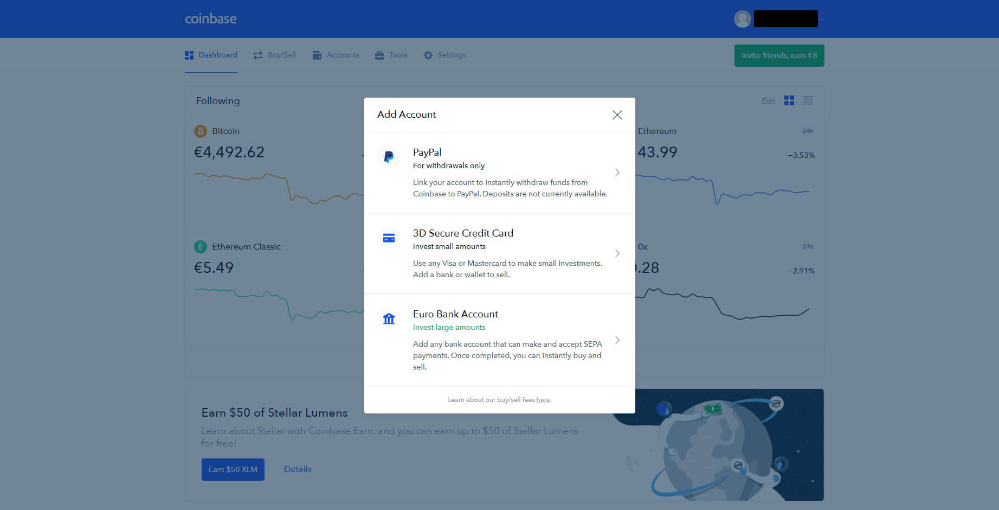

### Passer Coinbase en français

En bas à droite du site vous trouverez un menu déroulant vous permettant de changer la langue, et de quitter la langue de la perfide Albion pour retrouver notre bon vieux français. 

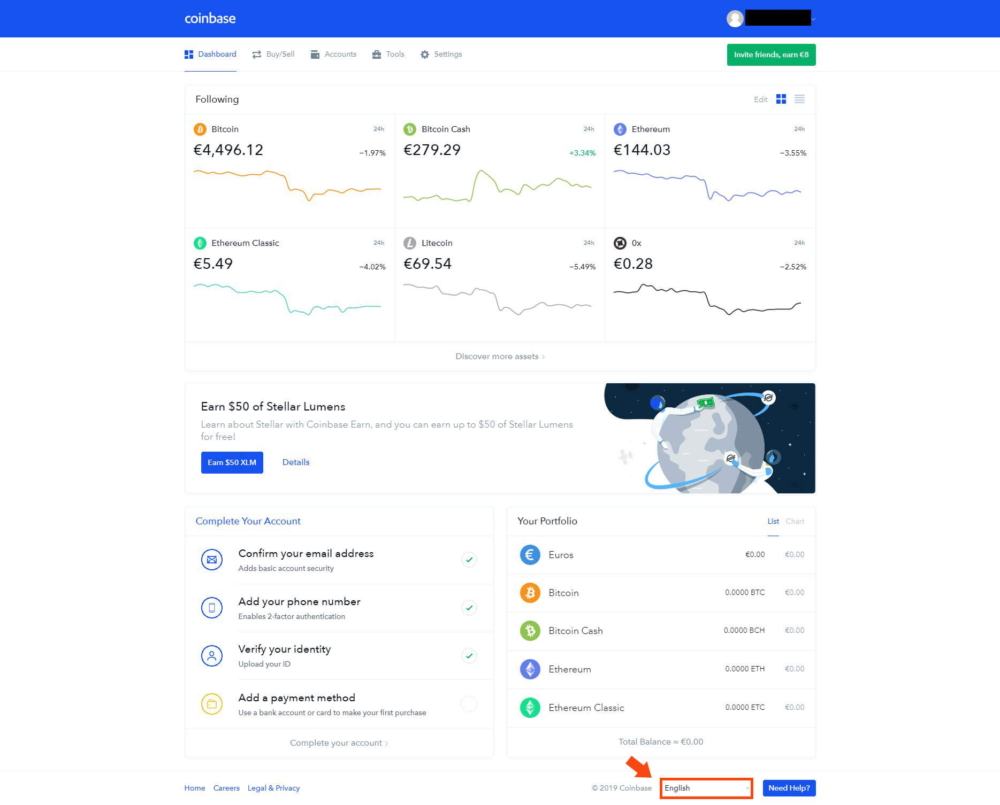

Nous voici avec un site en français, parfait. Mais maintenant il va falloir retrouver notre popup nous permettant d'ajouter des moyens de paiements. Pour ce faire rien de plus simple, cliquer sur "**Paramètres**", puis sur "**Comptes associés**". Enfin, cliquer sur le bouton central "**Associer un nouveau compte**".

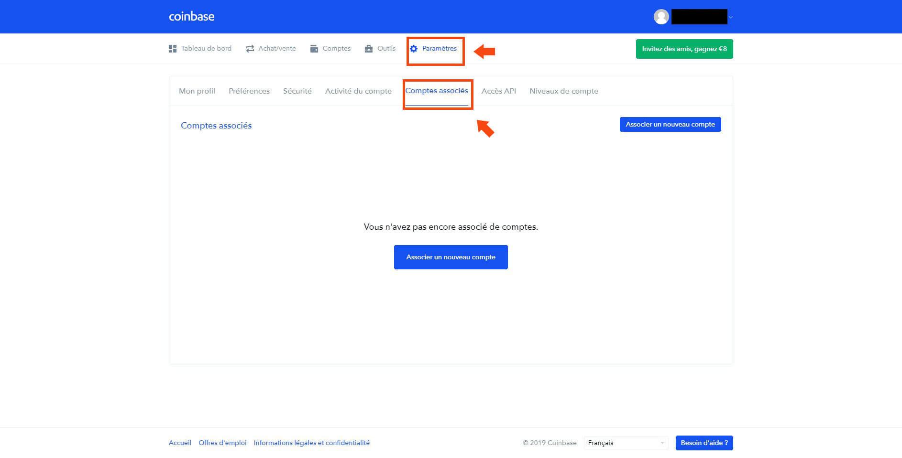

Revoilà notre interface de tout à l'heure, mais dans la langue de Molière cette fois.

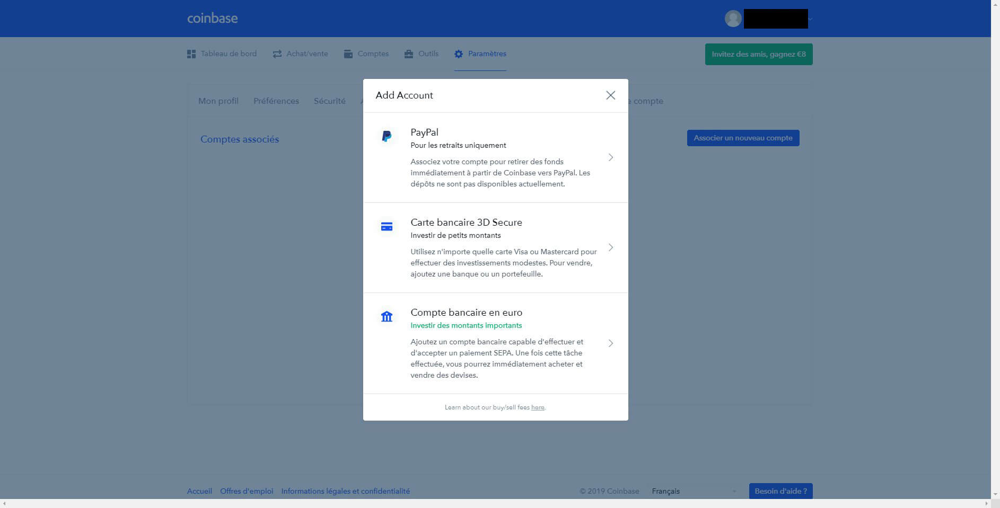

Pour associer un compte Paypal, rien de bien compliqué. Cliquer sur la première option pour être redirigé vers l'interface de Paypal, connectez-vous à votre compte et accepter l'association. Voilà, c'est fait.

La seconde option vous permet d'associer votre carte bancaire (et donc d'utiliser celle-ci pour faire vos emplettes). Remplissez les champs avec vos informations personnelles et cliquer sur "**Ajouter une adresse de facturation**". 

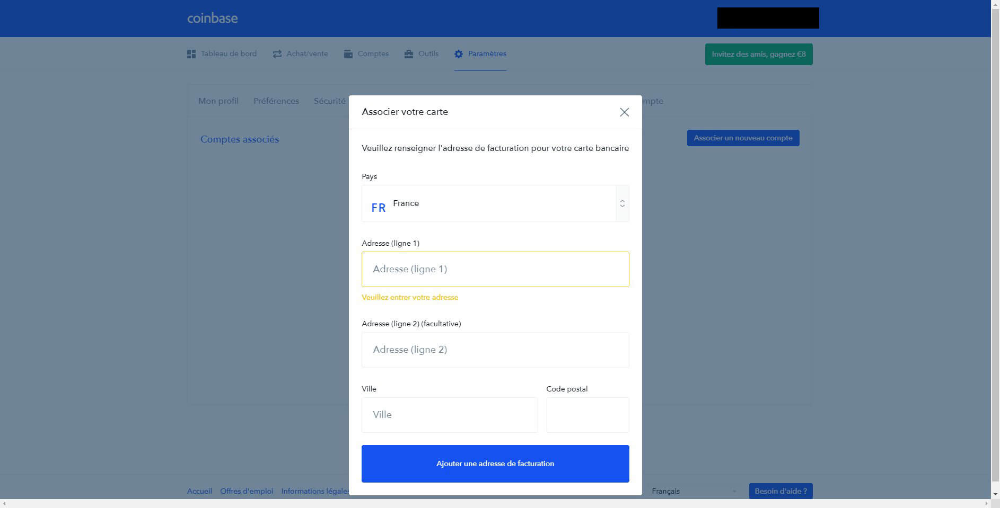

L'écran suivant vous demandera d'entrer les informations relatives à votre carte bancaire. Rien de bien sorcier ici. Une fois ceci fait, vous aurez enfin la possibilité d'acheter vos premières cryptos. À moins que vous ne préfèreriez réduire les frais, et passer par un virement bancaire pour déposer vos fonds.

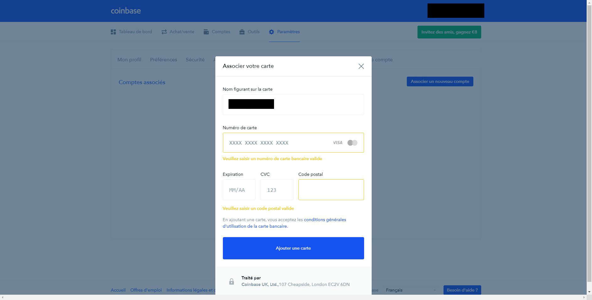

Pour lier votre compte bancaire et vous ouvrir la possibilité de transférer vos fonds par virement SEPA, cliquer sur la troisième option (Compte bancaire en euro). 

L'écran suivant vous demandera d'indiquer les informations relatives à votre compte. Si vous ne savez pas où les trouvez, **ce sont les informations inscrites sur vos RIB** (en général facilement téléchargeables depuis vos espaces de gestion de comptes en ligne). Une fois les champs remplis, cliquer sur "**Vérifier votre compte**". 

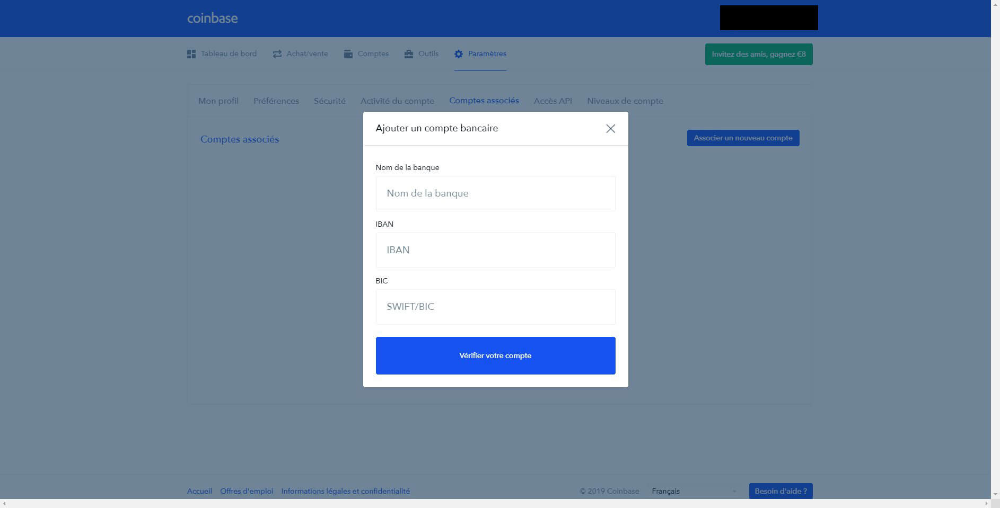

Un message va alors s'afficher à l'écran, comprenant les informations bancaire de Coinbase. **Notez les!** Elles vous seront utiles pour enregistrer Coinbase comme possible bénéficiaire de vos virements. 

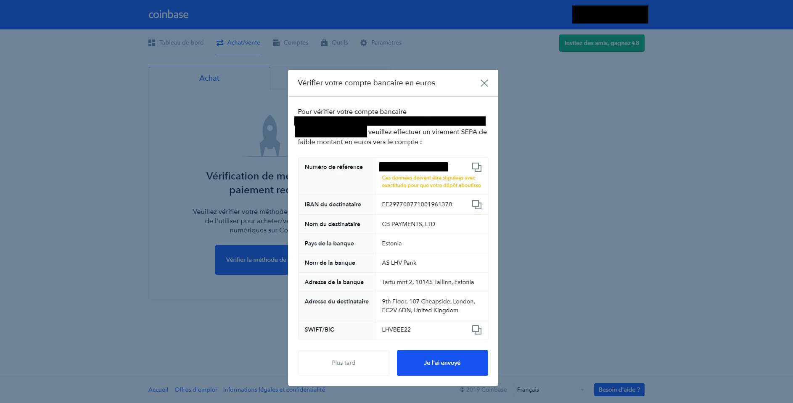

Pour ce faire, rendez vous sur l'interface de votre banque et ajouter Coinbase à la liste des comptes bénéficiaires (la procédure et les intitulés varient suivant les banques, donc impossible de vous expliquer cette partie pas à pas, mais vous trouverez en général cette option dans la partie Virements de votre gestion de compte). 

Remplissez les informations de ce nouveau bénéficiaire avec celles inscrites à l'écran (vous aurez normalement besoin de l'IBAN, du nom de la banque et du destinataire ainsi que de son adresse).

Une fois le compte ajoutée, il ne reste plus qu'à patienter. Il existe en effet un délai entre l'ajout d'un nouveau compte bénéficiaire et la possibilité d'y effectuer son premier virement. Celui-ci est en général de 72h. 

*Note importante: Coinbase Europe étant basée en Estonie, il est tout à fait possible que vous rencontriez des difficultés  avec votre banque pour ajouter ce compte. Vous devrez alors contacter votre conseiller bancaire pour qu'il vous débloque la possibilité de faire des virements européens.*

Une fois ces épreuves derrière vous et le compte de Coinbase enregistré comme nouveau bénéficiaire, il est temps de passer à la dernière étape: le virement de vérification.

Munissez vous du numéro de référence indiqué dans les informations bancaires de Coinbase (celles que vous avez notées) et effectuez un virement d'un faible montant (1€) vers le nouveau compte bénéficiaire. Entrer le numéro de référence dans la partie "**Libellé**" ou "**Référence**" de votre virement. Ne reste plus qu'à patienter (le délai varie selon les banques, mais comptez environ 1 à 2 jours ouvrés pour recevoir votre virement). Passé ce délai, vous devriez recevoir un email vous confirmant la bonne réception de votre dépôt. 

Bravo, vous pouvez maintenant utiliser les virements SEPA pour transférer vos fonds vers Coinbase et acheter vos cryptos (**n'oubliez pas d'entrer votre numéro de référence à chaque virement, sans quoi celui-ci pourrait ne jamais arriver**!).

## Sécuriser votre compte grâce à la double authentification

Avant de commencer à transférer des fonds sur Coinbase, mieux vaut prendre toutes les précautions niveau sécurité. Et pour cela, rien de mieux que d'activer la **double authentification**.

Cliquer sur l'onglet "**Paramètres**", puis sur le sous-onglet "**Sécurité**". Au milieu de la page se trouve le bouton d'activation de la double authentification. 

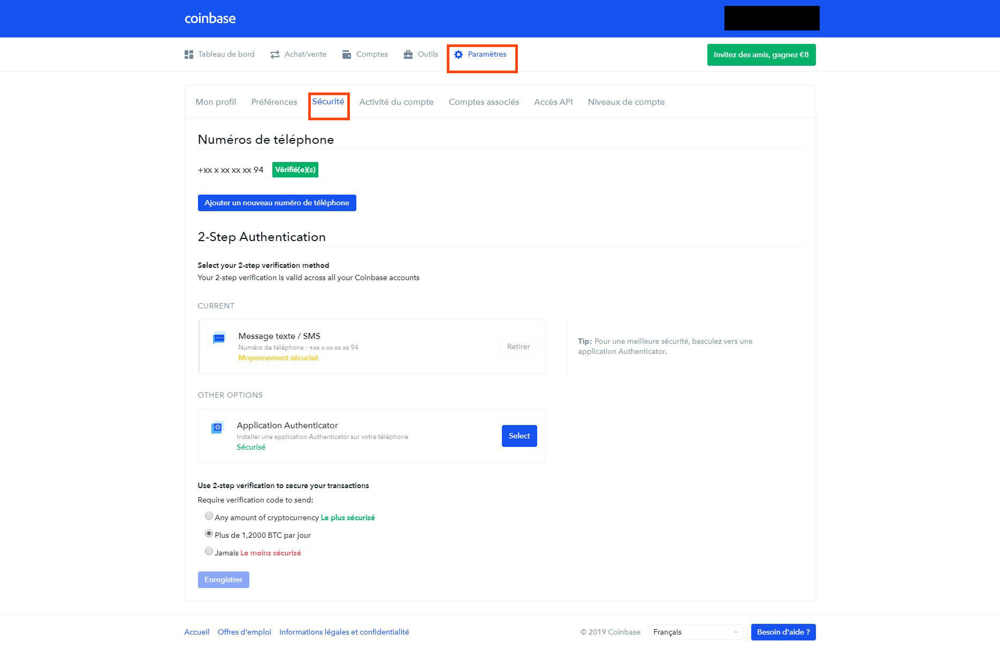

Après un premier écran vous demandant de vérifier le code que vous venez de recevoir par sms, vous arrivez sur l'écran d'activation d'Authenticator. Ouvrez votre application dédiée (si vous n'en disposez pas, je vous conseille [Google Authenticator](https://support.google.com/accounts/answer/1066447?co=GENIE.Platform%3DAndroid&hl=en), disponible sur Android et iOS) et scannez le QR code présent à l'écran. 

Ne reste plus qu'à valider en saisissant le code de vérification à six chiffres associé à Coinbase. Voilà, votre compte comporte maintenant un niveau de sécurité supplémentaire. 

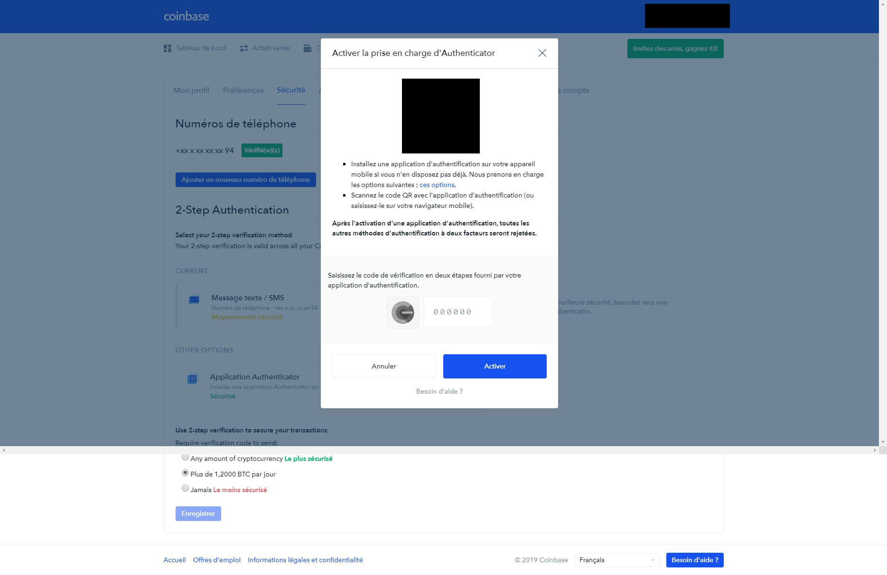

## Comment placer des ordres ?

### Achat

Pour acheter vos premières cryptomonnaies, rendez-vous dans l'onglet "**Achat/vente**". 

Choisissez la crypto de votre choix dans le menu déroulant, votre méthode paiement et le montant désiré (attention, vous serez limité par un plafond hebdomadaire de 50€ dans un premier temps, cette limite augmentera sensiblement une fois 100€ dépensés sur la plateforme).

Ne reste plus qu'à cliquer sur le bouton "**Acheter des ...**". Patientez quelques instants et profitez de votre achat. Vous voilà maintenant possesseur de cryptomonnaies.

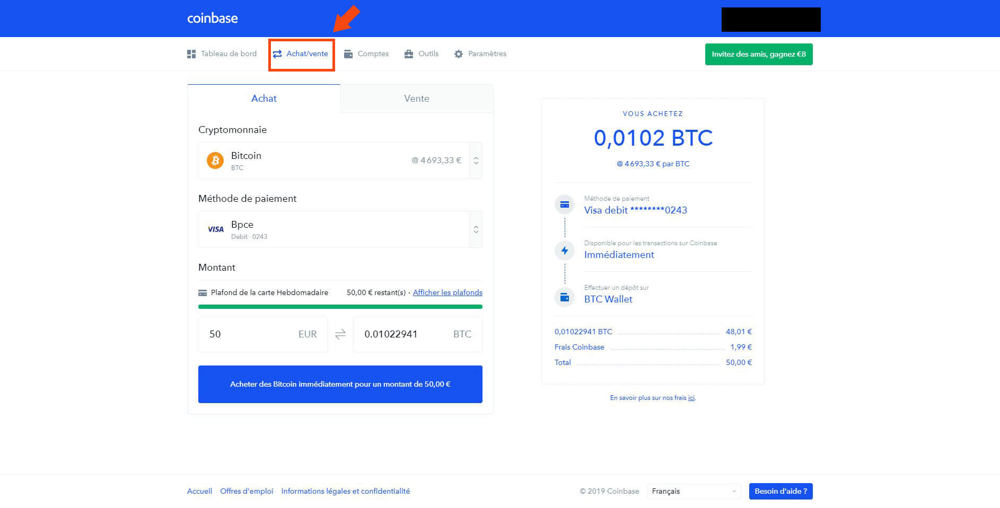

### Vente

Pour vendre, le principe est le même. Cliquez sur l'onglet "**Vente**", choisissez la cryptomonnaie dont vous voulez vous séparer et le montant (en crypto) désiré, puis cliquez "**Vendre des ...**". 

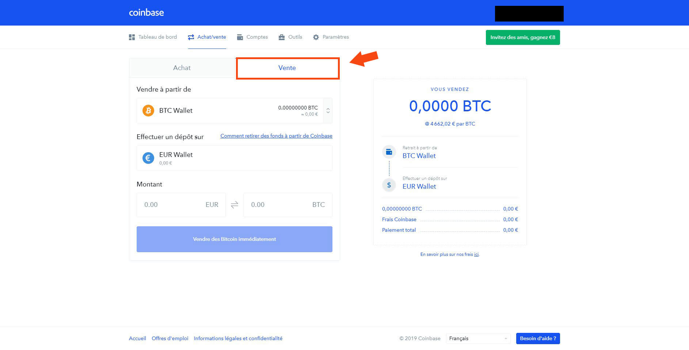

## Vérifier votre solde

Vérifier l'état de votre solde sur Coinbase est assez simple. Pour cela, deux options s'offrent à vous:

* depuis l'écran d'acceuil
* depuis l'onglet "Comptes"

Sur l'écran d'acceuil de Coinbase, en bas à gauche, vous trouverez un bloc "**Votre portefeuille**", celui-ci contient un récapitulatif de vos fonds. Pratique, mais assez limité.

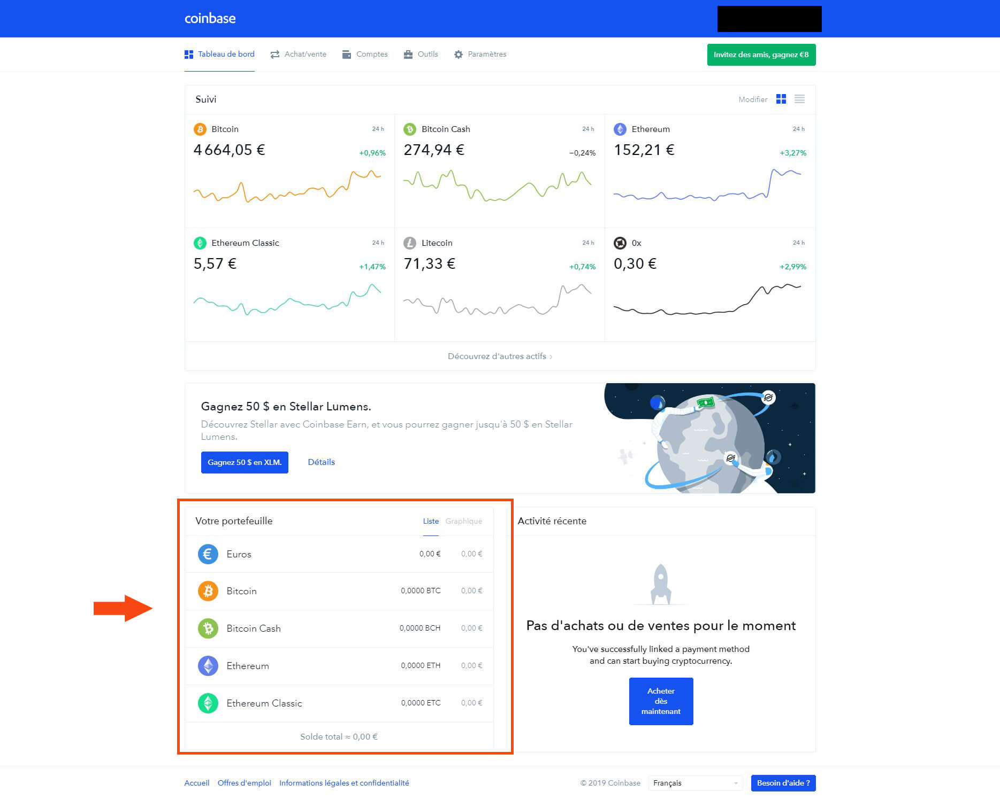

Pour une visualisation plus complète, rendez-vous sur l'onglet "**Comptes**". Dans la partie gauche, vous trouverez un menu déroulant affichant l'ensemble des cryptomonnaies stockables sur Coinbase. 

Sous chacune d'entre elles, vous pourrez voir le montant en votre possession, ainsi que son équivalent en euros après conversion au cours actuel. 

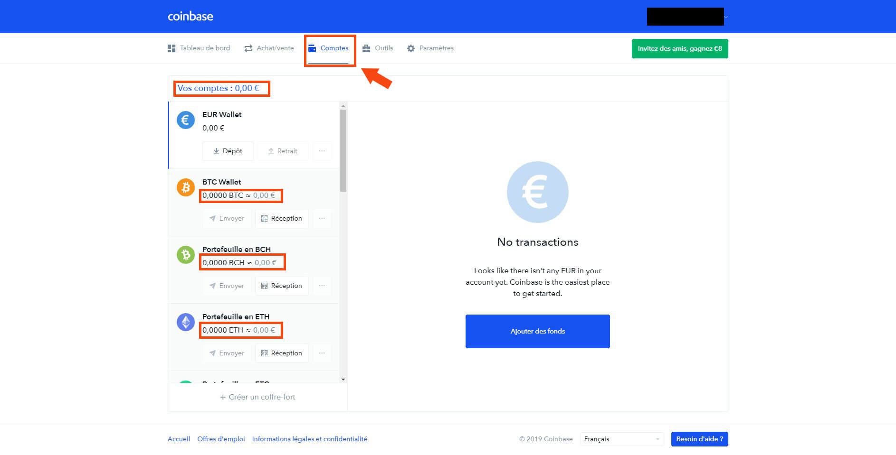

## Comment déposer et retirer des fonds de Coinbase ?

### Dépôts

Pour envoyez des cryptos sur Coinbase, rendez vous sur l'onglet "**Comptes**" (le même que précédemment). Dans le menu déroulant (à gauche), cliquer le le bouton "**Réception**" correspondant à la crypto que vous souhaitez transférer. 

Une popup s'affiche alors sur votre écran, vous indiquant que l'envoi de tout autre cryptomonnaie, autre que celle choisie, vers ce portefeuille entraînera la disparition de vos fonds (il est toujours utile de le rappeler, **un portefeuille Bitcoin ne peut contenir QUE des Bitcoins**, n'essayez pas d'y envoyer autre chose, le transfert échouerait et vous perdriez vos fonds sans espoir de les récupérer). 

Une fois cet avertissement passé, vous tomberez sur un écran affichant votre adresse de réception:

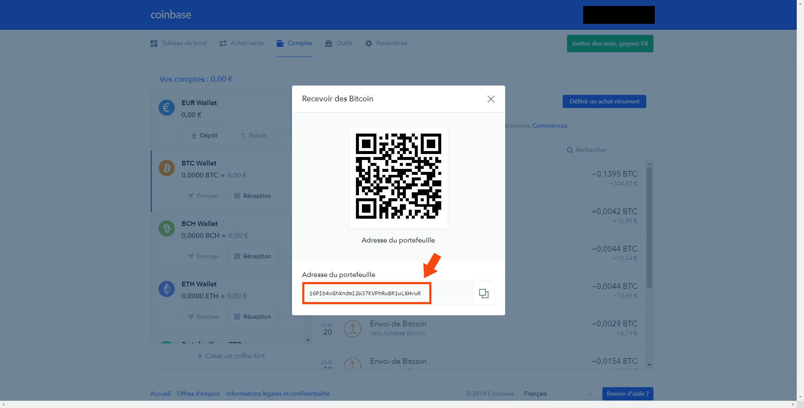

Copier l'adresse de votre portefeuille (la suite de lettres et de chiffres en bas) et rendez vous sur le wallet externe dont vous voulez extraire les fonds. Entrer l'adresse copiée plus haut comme adresse de destination (en vérifiant attentivement de ne pas avoir fait d'erreurs, pour cela **une bonne astuce est de vérifier les 4 ou 5 premiers caractères, ainsi que les 4 ou 5 derniers**). 

Cliquer sur envoyez et patientez le temps que votre transaction soit vérifiée (de quelques secondes pour les cryptos les plus rapides à plusieurs heures pour les plus lentes).

*Note importante: Certaines cryptomonnaies, comme le XRP (Ripple) ou le XLM (Stellar) vous demanderont une information supplémentaire pour pouvoir effectuer le transfert. Le "**Tag**" dans le cas du XRP et le "**Memo**" dans le cas du XLM. Ceux-ci vous sont indiqués sous votre adresse de destination, n'oubliez pas de les copier également, faute de quoi votre transaction finira perdue dans les lymbes*

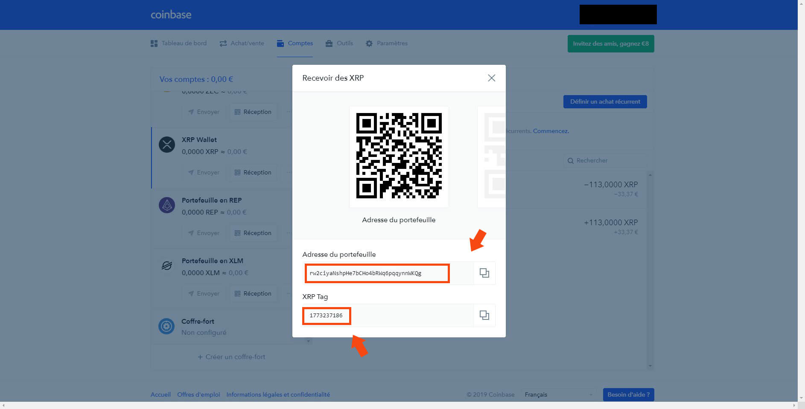

### Transfert

Pour sortir vos cryptos de Coinbase et les transférer sur un wallet externe, le processus est simple. Depuis l'onglet "**Comptes**" (toujours le même), cherchez la crypto que vous souhaitez transférer dans le menu déroulant, et cliquez sur le bouton "**Envoyer**" correspondant.

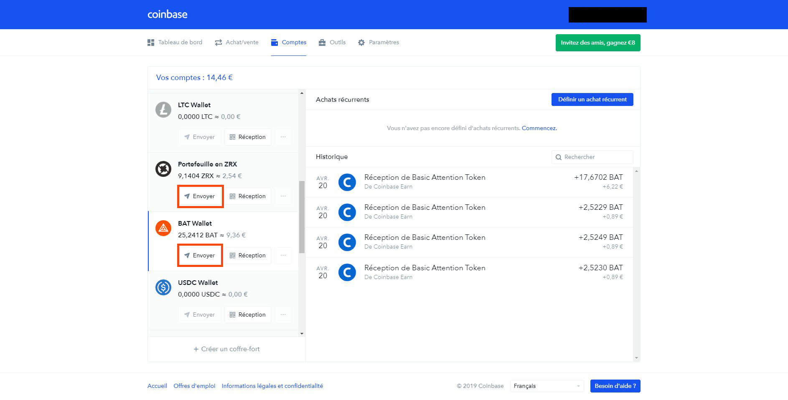

Saisissez l'adresse de destination dans le champ correspondant, en prenant bien soin de vérifier que tout soit en ordre, le montant que vous souhaitez transférer (soit directement en crytos, soit en équivalent euros) puis cliquez sur "**Continuer**" (**attention, dans le cas du XRP ou du XLM, pensez bien à également inclure le tag/memo en plus de l'adresse de destination**).

L'écran suivant vous affichera un récapitulatif de la transaction, incluant le montant des frais de minage que vous aurez à payer pour le transfert. Vérifiez une dernière fois qu'aucune erreur ne s'est glissée dans votre demande et cliquer sur "**Confirmer**". 

Ne reste plus qu'à patienter le temps que votre transaction soit enregistrée sur la blockchain correspondante avant de recevoir vos cryptos.

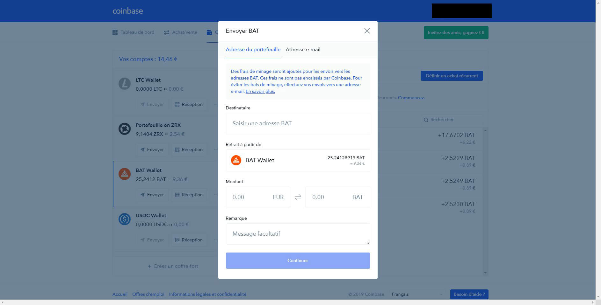

Une seconde option est également disponible lorsque vous souhaitez transférer des cryptos depuis Coinbase, l'envoi par adresse e-mail. Celle-ci n'est utile que dans un cas précis: si vous voulez envoyez vos crypto-actifs (ou une partie) vers un autre compte Coinbase. Un cas de figure assez rare donc, mais parfois pratique, si vous voulez envoyez une donation à un proche **qui possède son propre compte Coinbase** par exemple. 

Pour ce faire, cliquer sur le sous-onglet "**Adresse e-mail**", entrer l'email de votre destinataire (l'adresse liée à son compte Coinbase, pensez donc à bien vérifier avec lui/elle l'adresse en question), choisissez le montant de cryptos à transférer et cliquez sur "**Continuer**", puis sur "**Confirmer**".

Dans les faits, cette utilisation est assez anecdotique et il est peu probable que vous ayez à vous en servir un jour, mais sait-on jamais.

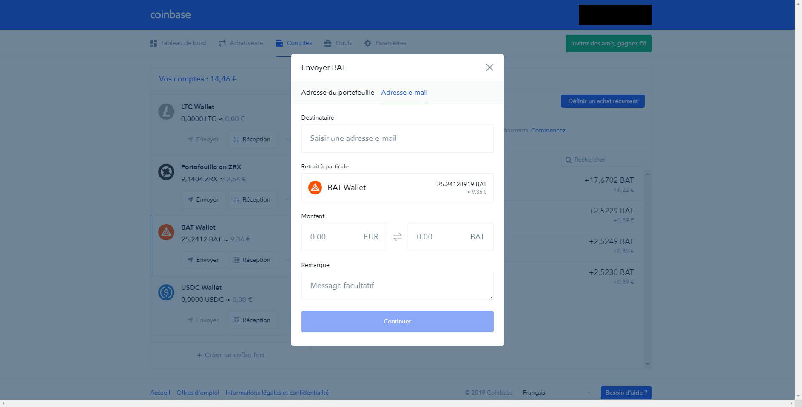

## Conclusion

Ce guide touche à sa fin. Vous savez maintenant **comment créer un compte Coinbase** et comment utilisez les principales fonctions du service. J'ai volontairement laissé de côté un aspect: la **création de coffre-forts**.

Les coffres-forts sont des sortes de *super-wallets* intégrés à Coinbase, conçus pour stocker des montants élevés de cryptos. A la différence des wallets classiques, ils offrent quelques fonctionnalités intéressantes, parmi lesquelles une possibilité de co-gestion (l'ensemble des co-gérants du coffre-fort devant approuver un retrait pour qu'il soit pris en compte) ou la mise en place de retrait différé. 

Malgré tout, si vous devez stocker des montants importants, **je ne pourrais que vous conseiller de plutôt vous tourner vers des solutions qui vous donnent un réel contrôle sur vos clés privées**. Un paper wallet, un [Ledger](https://www.ledger.com/?r=6ce75229a486) ou un software wallet comme [Exodus](https://www.exodus.io) ou [Electrum](https://electrum.org/#home) par exemple. Coinbase est une énorme société, mais personne n'est à l'abri d'un hack majeur, surtout pas dans le monde des cryptos. Leur confier la gestion et la sécurisation de votre fortune n'est probablement pas le meilleur choix.

Un conseil qui vaut d'ailleurs quel que soient les montants que vous possédez. À moins que vous ne soyez adepte du day-trading (auquel cas, vous n'utiliserez probablement pas Coinbase pour cela), **ne laissez pas vos cryptos sur le service. Une fois vos achats effectués, transférez les sur des wallets externes**. Prudence est mère de raison, ne l'oubliez pas.

Si vous avez apprécié ce guide et que vous souhaitez voir ce type de contenu plus régulièrement sur le site, n'hésitez pas à le mentionner en commentaire. Idem si vous avez des questions qui restent sans réponses, je me ferai un plaisir de tenter d'y répondre.